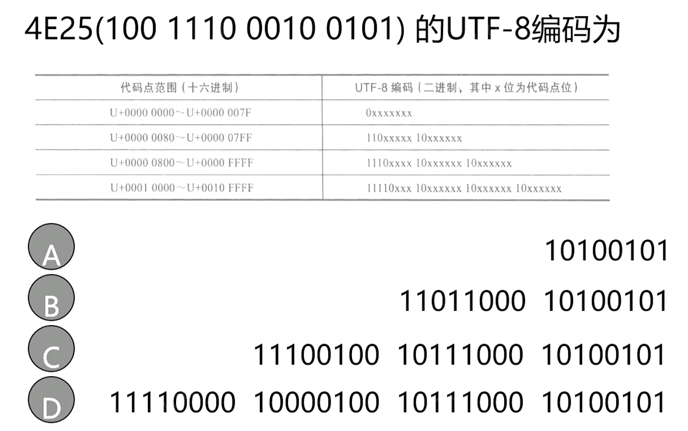

# 数字系统

## 一、数字系统

### 定义

- 什么是数字系统?
- 是一种==离散信息处理系统==
  - 一组离散形式的信息作为输入
  - 离散的内部信息作为系统状态
  - 产生离散形式的系统输出

### 分类

根据==是否有系统状态==

- 组合逻辑系统

  - 无状态记忆功能 

  - 输出值只与当时==系统输入==有关 

$$
\mathrm{output} = f(\mathrm{input})
$$

- 时序逻辑系统 

  - 具备状态记忆功能 

  - 输出值与当时==系统输入和状态==都有关

$$
\mathrm{output} = f(\mathrm{state},\mathrm{input})
$$
-  在离散时间点更新状态 > > 同步时序系统 

-  在任何时间点更新状态 > > 异步时序系统 

### 典型系统

- 数字计数器


>  ~~自己选了C~~，正确答案是D，因为我们可以在任何时间点按下，而按下才会触发，所以我们认为它是异步时序系统。而CPU主频这种就是指时钟频率，就是指同步时序系统。

- 数字计算机
- 嵌入式系统

## 二、信息表示

### 定义

- 信息 

  -  对物质世界与人类社会中存在现象的表示 

  -  可以==消除不确定性== 

  -  信息熵（不确定性越大信息熵越大）

  - 熵增定律

- 信号 

  -  信息表示的物理载体 

  -  模拟信号：==连续的==物理量 

  - 数字信号：==离散的==物理量

### 二进制表示

- 数字系统广泛采用两个离散值，称二进制 

  -  数字0和1

  -  符号真(T)和假(F) 

  -  符号高(H)和低(L) 

  -  符号开(On)和关(Off)

- 可以用不同物理量来实现二进制
  -  电压、磁场方向、电荷量


> 为了更容易识别输入，我们设计输入的高低界限间隔更小；输出的可区分性越大越好；输入的时候尽可能的识别更多；

## 三、数制

- 数的表示规则称为数制

- 基底(r)：一个数制所包含的数字符号的个数


- 权($r^i$ ) ：数字符号的位置决定的值
- 值是各位数字值与其权之积的总和


### 定义


> 这里要注意最后的字符BQD都是需要考的，
>
> 下列数最大的是
>
> 1. 142Q
> 2. 62H
> 3. 01100100B
> 4. 98D
>
> 142Q = 1x64+4x8+2=64+32+2=98
>
> 62H=6x16+2=98
>
> 0110 0100B=1x64+1x32+1x4=100
>
> 98D=98
>
> 所以是二进制那个最大

### 运算

- 二进制加减乘（同十进制）

|                             加法                             |                             乘法                             |                             减法                             |
| :----------------------------------------------------------: | :----------------------------------------------------------: | :----------------------------------------------------------: |
|  |  |  |

- 八、十六进制加减乘 

  -  将同一列对应位转换为十进制 
  -  计算完后再转换为原进制

| 十六进制加法                                                 | 八进制乘法                                                   |
| ------------------------------------------------------------ | ------------------------------------------------------------ |
|  |  |

### 转换

- 非十进制→十进制 
  -  按权展开

- 非十进制相互转化 

  -  1个八进制位=3个二进制位

  -  1个十六进制位=4个二进制位 

  -  以小数点为界


- 十进制→非十进制 
  -  整数部分：除r取余 
  -  小数部分：乘r取余


## 四、编码

### 二进制编码

- 通过0、1排列的组合方式表示数据

- n位二进制编码可以表示$2^n$个数据 

- 数据类型 
  -  数值型：能进行算术运算，如整数、小数 
  -  非数值型：一般不需算术运算，如字符、控制符 

- 表达M个数据需要二进制位数

$$
\lceil log_2(M) \rceil
$$

### BCD码

- 采用二进制编码十进制数 

- 用4位二进制表示0~9，6个冗余

- BCD码 

  -  8421码 

  -  最简单，最直觉 

  -  加权码，权值8,4,2,1 

  -  1010到1111 无意义 

- 进制转换 VS 编码 

  -  进制转换： $13_{10} = 1101_2$ 

  -  编码： $13 \Leftrightarrow 0001|0011$


> BCEF

### 格雷码

- 计数过程中，相邻编码之间只有一位不同 

- 格雷码不唯一

- 特点 

  -  计数电路中，位==翻转次数少==，功耗低 

  -  光学轴角编码器转动中，==避免错误编码==

编制格雷码(NO BB, show you code)

```python
def generate_gray_code(n):
    """
    生成 n 位格雷码
    @Args: n: int，格雷码位数
    @Returns: List[str]，由 n 位格雷码组成的列表
    """
    if n == 1:
        return ['0', '1']
    else:
        prev_gray_code = generate_gray_code(n-1)
        first_half = ['0' + code for code in prev_gray_code]
        second_half = ['1' + code for code in prev_gray_code[::-1]]
        return first_half + second_half
```

```python
In [2]: generate_gray_code(1)
Out[2]: ['0', '1']

In [3]: generate_gray_code(2)
Out[3]: ['00', '01', '11', '10']

In [4]: generate_gray_code(3)
Out[4]: ['000', '001', '011', '010', '110', '111', '101', '100']
```

BCD生成格雷码

```python
def bcd_to_gray(bcd):
    """
    将 BCD 码转换为格雷码
    @ Args: bcd: str，BCD 码（每个数字用四位二进制表示）
    @ Returns: str，对应的格雷码
    """
    gray = bcd[0]  # 第一个数字直接转换
    for i in range(1, len(bcd)):
        gray += str(int(bcd[i]) ^ int(bcd[i-1]))  # 异或运算得到格雷码(或者叫偶校验:偶数个1为0)
    return gray
```

```python
In [2]: bcd = "0100"

In [3]: bcd_to_gray(bcd)
Out[3]: '0110'

In [4]: bcd_to_gray("0110")
Out[4]: '0101'
```


>选C   0010 0100
>
>观察前两位，00，00，00，（00），01，01，01，（01）就是前面第第二位取反的意思
>
>观察后两位，00，01，11，（10），10，11，01，（00）可以很简单看出其实就是倒转的关系

### 字符编码

- ACII

-  美国信息交换标准编码 

-  7位二进制编码，低->高，B1…B7 

-  128个字符： 94可打印+34个控制 

-  特性 


- Unicode
  - 万国码、统一码 

  - 可表示几乎所有语言中的字符与文字 

  - 对字符规定了唯一代码点， U+0030表示0 

  - 不同方案 
  - UTF-8：1~4字节, ==与ASCII兼容== 
    -  UTF-16：2或4字节 
    -  UTF-32：4字节


- UTF-8编码 

-  单字节，第1位为0，7位为代码点(ASCII) 

-  n字节 

- 第1个字节n个1，1个0，后面字节前两位为10 
- 代码点位从后往前填入，剩下补0



> 答案选C，注意是从后往前依次填入，[见这里的code](./code)

### 校验位

- 检测数据传输中可能存在的错误

- 增加1位：表示编码中1个数是奇数或偶数 
  - 偶校验：偶数个1，校验位0 

  - 奇校验：奇数个1，校验位0


> 校验位的目的就是通过增加一位来满足序列应该有多少个1，比如下面左边就是偶校验，偶数个1则为零，保持序列中1为偶数个；奇数个1则为一，保持序列中1为偶数个。


- 不足 
  - 无法确定错误位 
  - 无法检测偶数个位出错

> 就是当有偶数个位置同时发生错误就无法校验了；而且就算只有一个位置发生错误也无法确定错误位置。


> 选B
