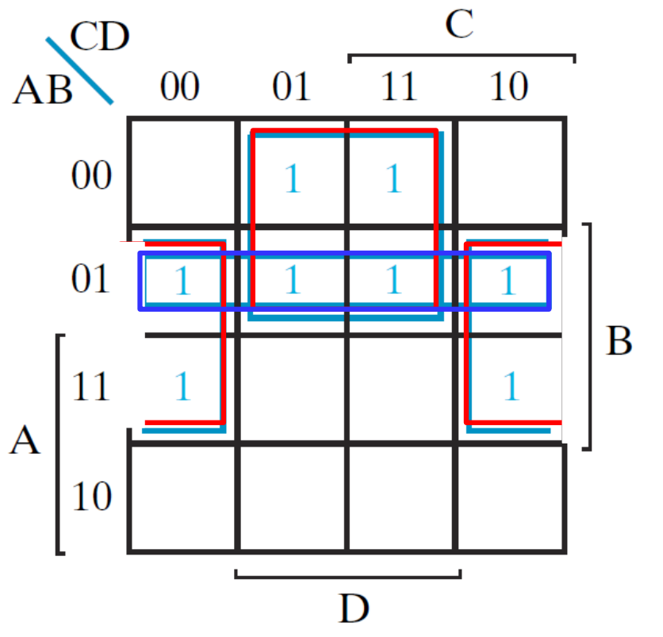

# 布尔代数

## 一、二值逻辑 

### 定义 

-  描述二值变量以及对其施加的逻辑运算 

➢ 变量取值为0或1 

➢ 基本逻辑运算 

-  与（AND） X·Y , XY 

-  或（OR） X+Y 

-  非（NOT） X 

-  二值逻辑==类似于==二进制运算 

➢ 与和乘 

➢ 或和加 

-  不同 

➢ 逻辑变量只能是1或0，而算术变量可任意

### 真值表

- 变量组合和结果的表形式

## 二、逻辑门 

| 定义                                                         | 定时图                                                       | 延时                                                         |
| ------------------------------------------------------------ | ------------------------------------------------------------ | ------------------------------------------------------------ |
|  |  |  |

### 定义 

处理一个或多个输入，产生一个输出信号电子电路 

➢ 实现基本逻辑运算 

➢ 与门 

➢ 或门 

➢ 非门或反相器

### 定时图 

➢ x: 时间 

➢ y: 电平

### 延时 

- 输入变化引起输出变化所需时间 

- 用$t_G$表示

### 其他门

| nand nor                                                     | xor xnor                                                     |
| ------------------------------------------------------------ | ------------------------------------------------------------ |
|  |  |

## 三、布尔代数 

### 定义 

- 布尔代数是处理二进制变量和逻辑运算的代数方法 

- 布尔表达式是由二进制变量、常量0和1、逻辑运算符和括号组成的==代数运算式== 

$$
D \overline{X} + A
$$

- 布尔函数是一个布尔等式，由函数变量、等号和布尔表达式组成

$$
L(D,X,A) = D \overline{X} + A
$$

- 布尔函数可以用==真值表==来表示 

- 布尔函数可以转换为==逻辑电路图== 

- 三者等价 

- 真值表唯一，布尔函数和逻辑电路图不唯一

> 试一下logisim的组合逻辑分析就理解了。

### 恒等式

- 对偶原则 

➢ 0和1对偶 

➢ 与和或对偶

| 单变量                                                       | 多变量                                                       |
| ------------------------------------------------------------ | ------------------------------------------------------------ |
|  |  |

- 德摩根定理验证：真值表 

- 德摩根定理可以扩展到三变量或者多变量

> 显然选C

### 代数运算 

- 不要记，从卡诺图理解就可以很快化简出来，或者自己手写也非常快：

| 代数运算                                                     | 卡诺图                                    |
| ------------------------------------------------------------ | ----------------------------------------- |
|  |  |

| 一致性定理                                                   | 对偶式                                                       | 卡诺图理解                                    |
| ------------------------------------------------------------ | ------------------------------------------------------------ | --------------------------------------------- |
|  |  |  |

### 反函数

- F的反函数：真值表中将F值1和0互换
- 函数取反方法：德摩根定理

> 显然选B

## 四、标准形式

### 最小项和最大项

| 最小项                                                       | 最大项                                                       |
| ------------------------------------------------------------ | ------------------------------------------------------------ |
| 所有变量以原变量或反变量==按序出现==，这样的乘积项叫做==最小项== | 所有变量以原变量或反变量按序出现，这样的求和项叫做==最大项== |
| n个变量，共有$2^n$个不同的最小项                             | n个变量，共有$2^n$个不同的最大项                             |
| 对应变量的1个组合，对该变量组合最小项为1                     | 对应变量的1个组合，对该变量组合最大项为0                     |
| 变量组合对应的二进制值为最小项序号                           | 变量组合对应的二进制值为最大项序号                           |
|  |  |

> 选AD，B顺序不对

### 最小项之和和最大项之积

| 概念                                                         | 例子                                                         |
| ------------------------------------------------------------ | ------------------------------------------------------------ |
| 最小项和最大项关系                                           |  |
| ==最小项之和== ➢ 由真值表中所有函数取值为1的最小项之和       |  |
| ==最大项之积== ➢ 由真值表中所有函数取值为0的最大项之积 ➢ 也可反函数==最小项之和取反==得到 |  |

- 缩写好处 

➢ 容易进行比较 

➢ 和真值表对应

> 选A

### 积之和和和之积

-  积之和 

➢ 先与门后或门 

-  和之积 

➢ 先或门后与门 

-  均为两级电路 

-  可看出 

➢ 不同的标准形公式复杂度不同 

➢ 对应不同的电路实现

## 五、卡诺图

### 成本标准

- 成本标准：衡量电路的==复杂度==，==优化目标== 

| 成本                                                    | 例子                                                         |
| ------------------------------------------------------- | ------------------------------------------------------------ |
| 文字成本(L)：逻辑图对应的表达式中==文字个数==           |  |
| 门输入成本(G)：逻辑图中门的==输入端==个数，==不算非门== |  |
| 带非门的门输入成本(GN)：门的输入端个数，算非门          |  |

> 注：如果同一个输入，其非门算一次（共享）

> 显然选C

### 卡诺图 

- 卡诺图：方格组成的集合

➢ 每个方格代表1个==最小项== 

➢ 真值表的变形 

➢ 布尔函数的图形表示 

- 简化布尔函数的工具：尽量降低电路成本

- 卡诺图构造 

➢ 1. 方格数量等于最小项数量 

➢ 2.1 行变量和列变量位于左上方，每一行/列标记变量的二进制组合$m_i$

➢ 2.2 或变量取值为1的行/列用方括号括起，在变量旁边标1个变量 

➢ 3. 相邻项只有==一个变量值不同==（格雷码）

| comment                                                   | K map                                                        |
| --------------------------------------------------------- | ------------------------------------------------------------ |
| 二变量卡诺图 ➢ 变量顺序 ➢ 最小项序号排序                  |  |
| 三变量卡诺图 ➢ 变量顺序 ➢ 最小项序号排序 ➢ 最小项相邻关系 |  |
| 四变量卡诺图 ➢ 变量顺序 ➢ 最小项序号排序 ➢ 最小项相邻关系 |  |

> 选B
>
> 

### 卡诺图化简

- 相邻方格：二进制表示中只有一个变量值不同 

| 基于定理                                                     | 消去变量                                                     |
| ------------------------------------------------------------ | ------------------------------------------------------------ |
|  |  |

- 通过矩形（含$2^n$方格）可减少乘积项变量个数 

- 若矩形贯通变量的01，则该变量被消去 

  - 2个方格减少1个变量 

  - 4个方格减少2个变量 

  - 8个方格减少3个变量 

  - 16个方格减少4个变量

## 六、系统化简

### 蕴含项

- 蕴含项 

➢ 是乘积项 

➢ 由1方格组成的==矩形== （随便画一个矩形都是蕴含项）

- 主蕴含项 

➢ 是蕴含项 

➢ 由==尽可能多==的1方格组成的矩形 （尽可能大）

- 质主蕴含项 

➢ 是主蕴含项 

➢ 有至少1个1方格==仅存在于该矩形==

### 系统化简

| 步骤                                                         | K map                                                        |
| ------------------------------------------------------------ | ------------------------------------------------------------ |
| ① 确定所有主蕴含项                                           |  |
| ② 对质主蕴含项进行逻辑和                                     |  |
| ③ 加上 非质 主蕴含项 来覆盖未被包含的1 （➢ 选择规则 a. 尽可能减少主蕴含项重叠 b. 选择主蕴含项至少覆盖一个未被包含的1） |  |

### 和之积优化

| 步骤                                      | K map                                                        |
| ----------------------------------------- | ------------------------------------------------------------ |
| ① 反函数的积之和：将标记为0的方格进行优化 |  |
| ② 将反函数取反：对偶式+变量取反           |  |

### 无关最小项

- 函数对某些变量组合（最小项）==取值不确定== 

➢ 某些变量组合不会出现 

➢ 对某些变量组合的输出不关心 

- 这类函数称为不完全确定函数 

- 无关最小项：未指定函数值的最小项 

- 在卡诺图中将无关最小项表示为 x 

- x 有助于卡诺图化简 

➢ 1方格化简时，可包含使得主蕴含项最简单的 x 

➢ 0方格化简时，可包含使得主蕴含项最简单的 x

> ABCD