## 一、设计过程 

例子：设计一个BCD码到余三码转换电路

### 规范化

指定组合电路行为

- 输入：0到9的BCD码表示，分别为0000-1001 

- 输出：0到9的余三码表示，在BCD码上加0011

### 形式化

用真值表对输入输出形式化

- 由于只有4位，用真值表很容易表示 

- 输入 BCD码 A,B,C,D

- 输出 余三码 W,X,Y,Z

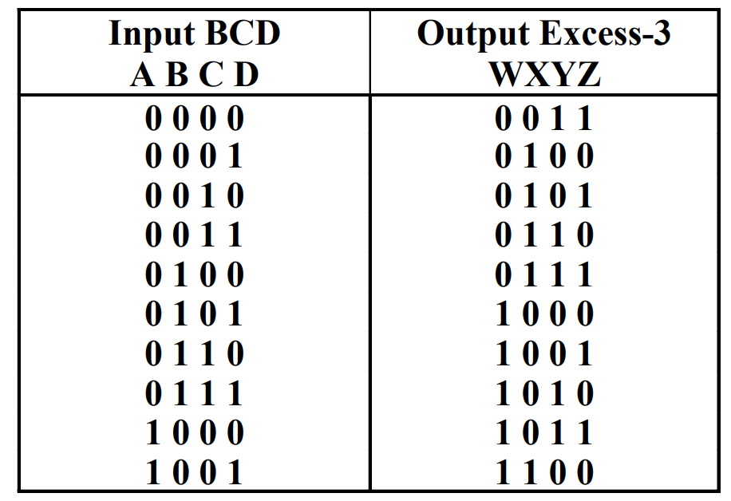

### 优化

优化逻辑，减少门输入成本，如卡诺图优化

- 优化目标

➢ 门输入成本G ➢ 即逻辑图中门的输入端的个数

| 卡诺图                                                       | 方程                                                         |
| ------------------------------------------------------------ | ------------------------------------------------------------ |
| 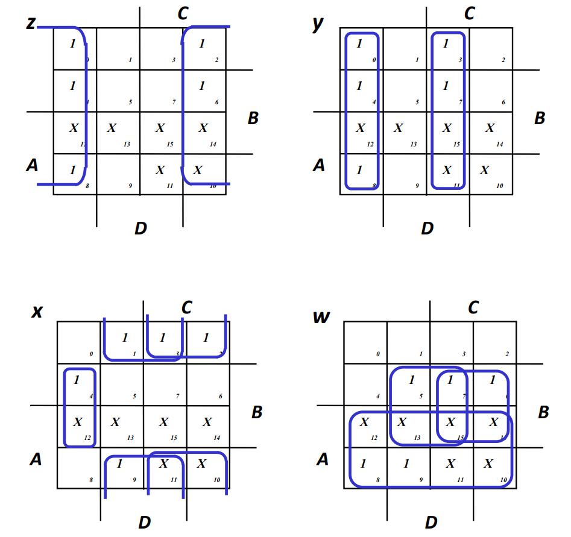 | 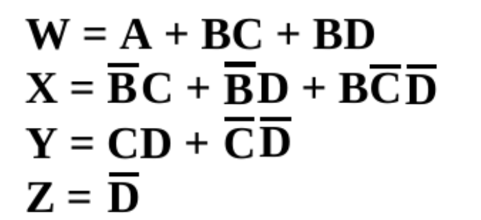 |

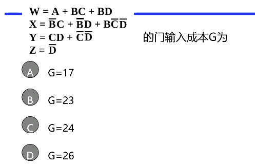

> W = 5 + 2 = 7
>
> X = 7 + 3 = 10 / 10 + 1 + 2
>
> Y = 4 + 2 = 6 / 6 + 2
>
> Z = 0
>
> 23  ,选C

- 进一步优化思想：提取公因子，共享电路

| 进一步优化前                                                 | 进一步优化后                                                 |
| ------------------------------------------------------------ | ------------------------------------------------------------ |
| 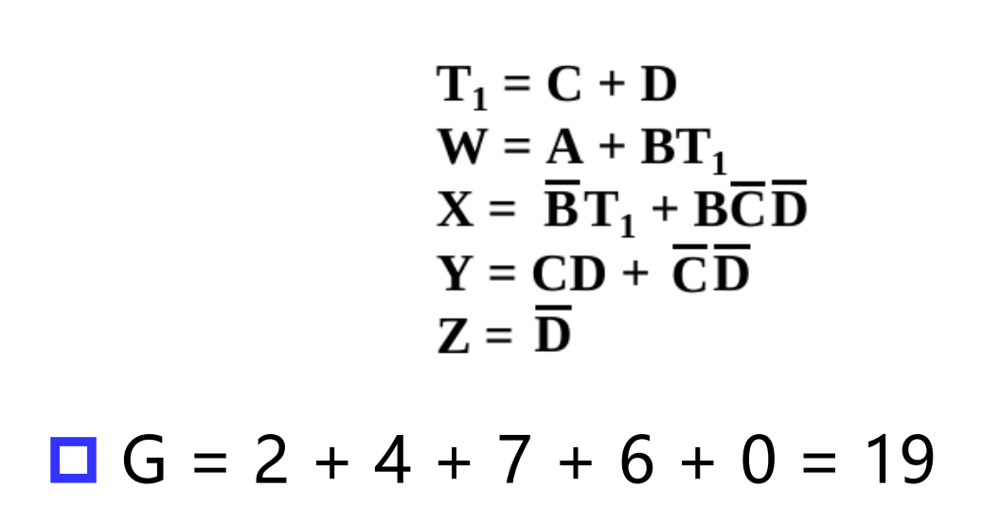 | 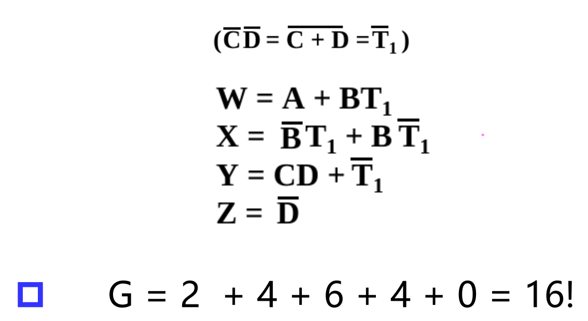 |

### 工艺映射

$$
\text{下面是一些连接词完备集}\\
\begin{align}
\{\neg,\lor\}\\
\{\neg,\land\}\\
\{\neg,\rightarrow\}\\
\{\uparrow \}\\
\{\downarrow \}\\
\end{align}
$$

将优化后逻辑映射到实现工艺

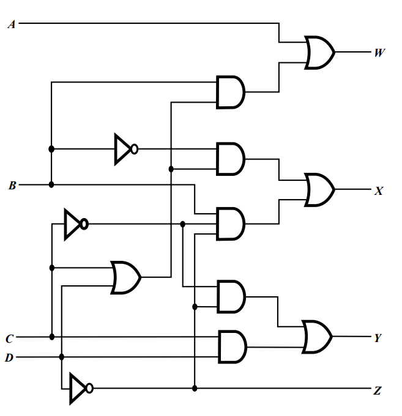

- 给定设计好的电路概要图 

➢（含与门、或门、反相）

- ==映射到与非门==（或或非门）

➢ 库中含反相器和n-输入与非门，n = 2, 3, … 

- 映射过程 

| 映射过程                                                 | 示例图                                                       | 具体例子                                                     |
| -------------------------------------------------------- | ------------------------------------------------------------ | ------------------------------------------------------------ |
| ① 用与非门替换掉与门和或门（可以稍微记住这个替换的方法） | 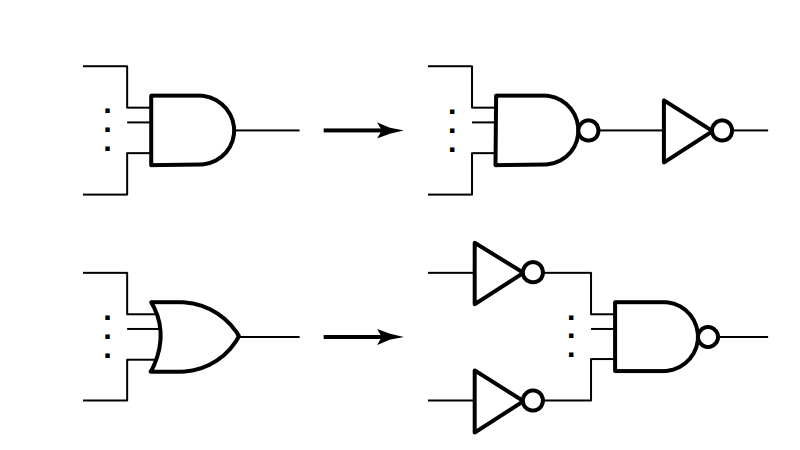 | 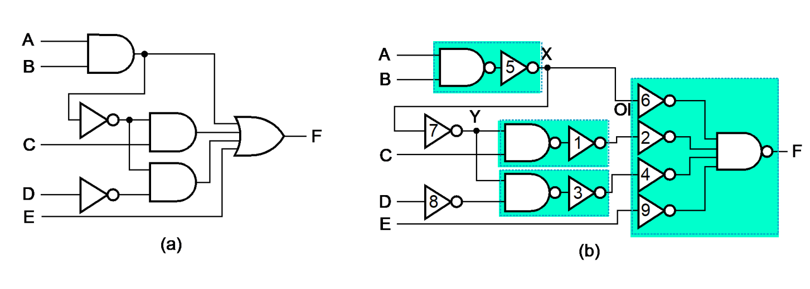 |
| ② 将反相器推过电路中的扇出点                             | 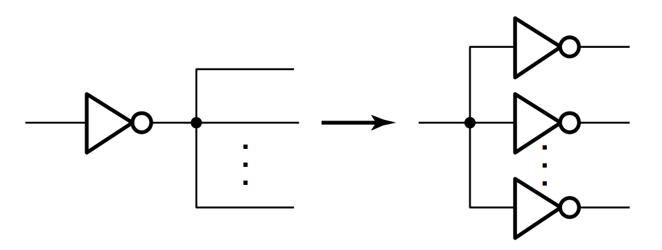 | 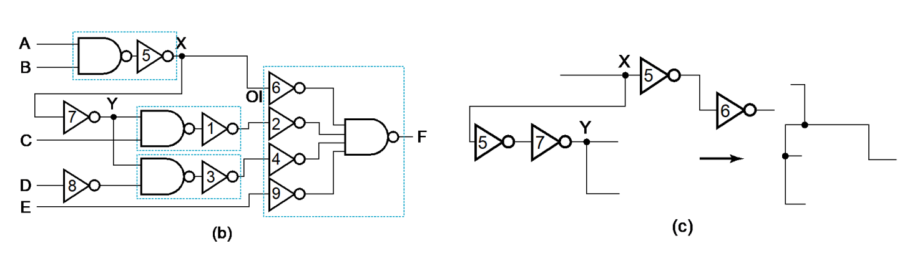 |
| ③ 抵消掉反相器对                                         | 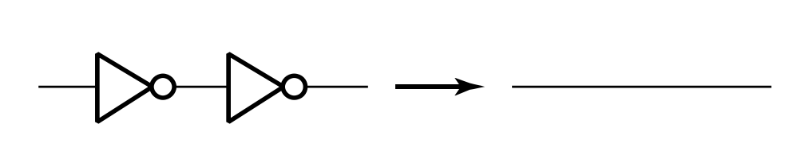 | 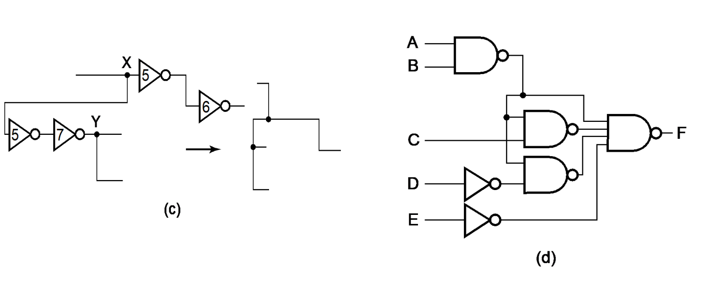 |

④ 重复②和③直到在a和b之间==只存在1反相器== 

a. 电路输入或与非门的输出 

b. 与非门输入

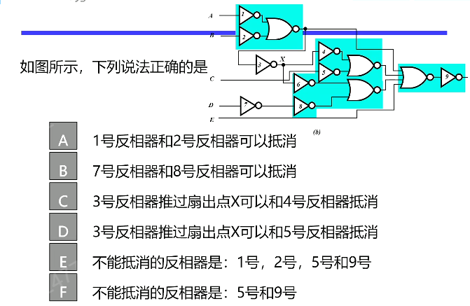

> 显然选BCE

- 映射到或非门例子

| 用与非门替换                                                 | 抵消反相器                                                   |
| ------------------------------------------------------------ | ------------------------------------------------------------ |
| 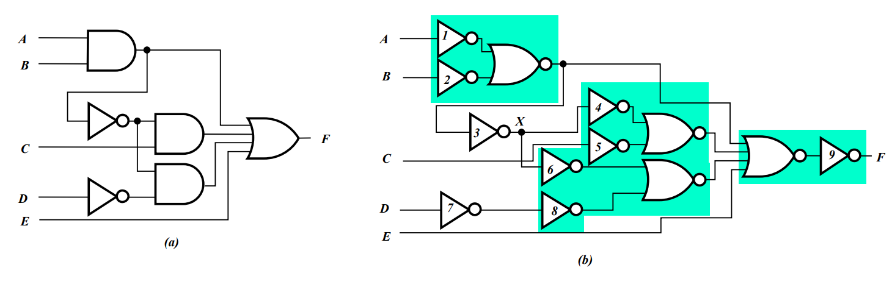 | 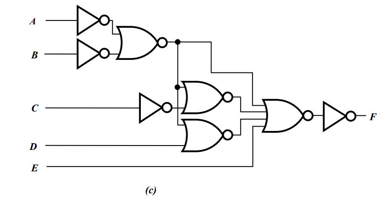 |

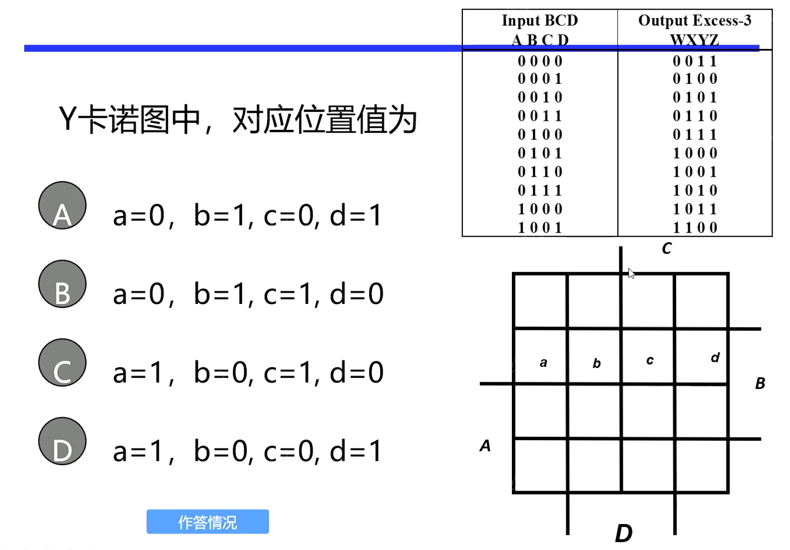

> 选C，如下所示
>
> 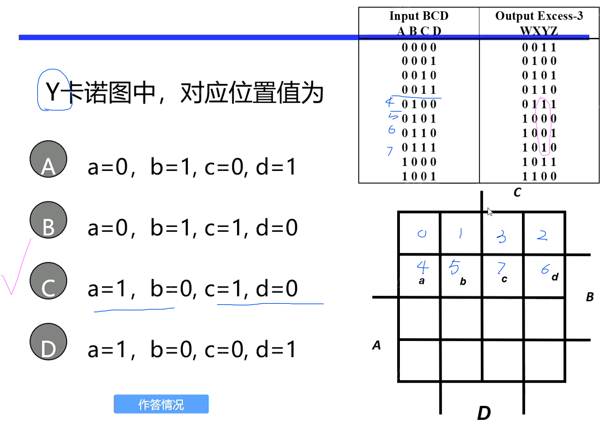

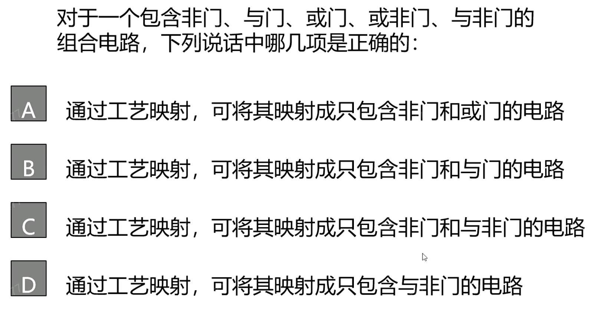

> ABCD，根据完备集，肯定全部都是对的

### 验证

- 人工逻辑分析 

➢ ==找出==实现电路真值表或==方程式== 

➢ 将实现电路真值表和规范==真值表比较==，或 

➢ ==证明==实现电路的方程式和规范方程式==等价==

- 模拟

➢ 以Verilog为例：Verilog是一种硬件描述语言 

① 使用Verilog 对电路进行编程实现 

② 编写测试程序，即TestBench 

➢ 产生模拟信号 

➢ 将产生信号加到实现电路上 

③ 将输出与期望值比较