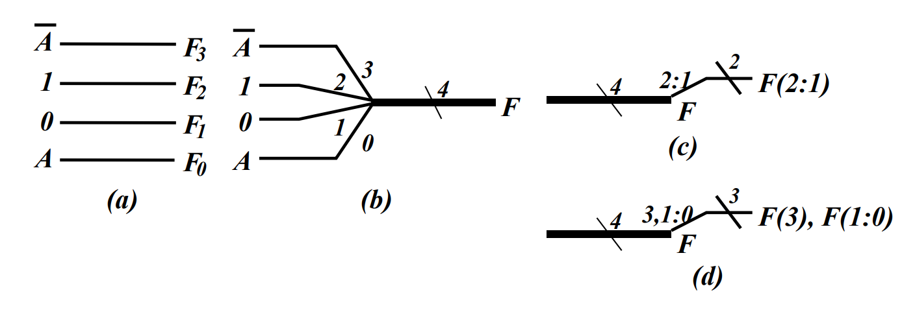

## 二、组合逻辑功能模块

### 组合功能模块

- 组合功能模块 

➢ 在电路设计中经常使用的==公共模块== 

➢ 每个功能模块对应一个==组合电路实现== 

- 按==集成度高低==的不同 

➢ 小规模集成电路（SSI): 10-100 个晶体管 

➢ 中规模集成电路（MSI): 100-1000 

➢ 大规模集成电路（LSI): 1000-100000 

➢ 超大规模集成电路（VLSI): 100000以上

- 芯片(集成电路)工艺（nm） 

➢ ==晶体管栅极==的宽度，也称栅长 

➢ 栅长越短 

➢ 同尺寸的硅片可集成更多晶体管 

➢ ==频率越高, 功耗更低== 

- 目前水平: 7nm, 迈向5nm

### 基本逻辑函数

| 函数类型                                                     | 例子                                                         |
| ------------------------------------------------------------ | ------------------------------------------------------------ |
| 单变量函数 ➢ 一个变量X的函数 ➢ 可以在输入处用作功能块        |     |
| 多位函数 ➢ 1位函数的==向量== ➢ 粗线代表==总线==，其是一个==向量信号==, 如图(b) ➢ 可以从总线中分割出一个==位子集==，如（c，d） |  |

- 使能函数

➢ 是否允许信号从输入传到输出 

➢ 引入使能信号EN 

➢ EN=1 允许信号传输 

➢ EN=0 阻止信号传输 

➢ 输出用固定值替代，可能是0或者1 

| F固定值是 0                                                  | F固定值是 1                                                  |
| ------------------------------------------------------------ | ------------------------------------------------------------ |
|  |  |

> AD

### 译码和译码器

- 译码 

➢ 输入n位，输出m ($n\le m \le2^n$) 位 

➢ 例子：输入二进制码，在输出中将对应位置1 

➢010→00000100 

> 译码和编码互逆

- 译码器 

➢ 实现译码功能的电路 

➢ n-m 译码器 

➢ 例子： 

➢ 输入：1的位置的编码，如010 

➢ 输出：只有1位是1的输出，如 00000100

| 如何设计一个1-2 译码器？                                     | 如何设计一个2-4译码器？                                      |
| ------------------------------------------------------------ | ------------------------------------------------------------ |
|  |  |

2-4译码器构成 ➢ 2个1-2译码器 ➢ 4个与门

- n-$2^n$译码器展开 

➢ 需要$2^n$个与门 

➢ 每个输出与门被==两个译码器==驱动 

​	➢ 这两个译码器==输入相等或相差1== 

➢ 将这两个译码器按照同样过程展开 

➢ 直至到1-2译码器 

- 上述过程可==经修改==应用到输出$\neq 2^n$ 的译码器

- 例子: 3-8 译码器 

➢ 需要8个输出与门 

➢ 每个输出与门被两个译码器驱动 

​	➢ ==最相近==的两个译码器 ($8=4\times2$)

​		➢ 2-4 译码器 

​		➢ 1-2 译码器

- 7-128 译码器 

➢ 需要128个输出与门 

➢ 每个输出与门被两个译码器驱动 

​	➢ 最相近的两个译码器 

​		➢ 4-16 译码器 

​		➢ 3-8 译码器

> ABCD
>
> 至于D是对的个人认为重点在于“可”，虽然不是最标准的划分；B对 40 = 8 + 32

- ==带有使能的译码器== (可以看作是解复用器DMX)

➢ 电路输出增加使能信号-EN 

- ==真值表== 

➢ 注意X可以表示0和1 

- 也被称为==1-4 多路分配器== (当EN变为输入数据、 $A_1A_0$ 为输出端选择信号时，此时便相当于将数据输出到选择输出端 )

- 同一电路，两个视角

### 基于译码器的组合电路

- 实现1个函数，其中有n个变量 

➢ 最小项之和的表达式，即标准型 

➢ 一个n-2 n 译码器，译码器输出对应最小项 

➢1个或门，将最小项或起来 

- 方法1: 

➢ 得到函数的真值表 

➢ 如果1在真值表中，就连接译码器输出和或门 

- 方法2: 

➢ 得到输出函数的最小项 

➢ 将最小项用或门连接起来

- 一位加法器

| 真值表                                                       | 实现                                                         |
| ------------------------------------------------------------ | ------------------------------------------------------------ |
|  |  |

- 但也有门输入成本高的缺点

### 编码和编码器

- 编码 

➢ 输入最大m ($n\le m \le2^n$ ) 位，输出n位 

➢ 例子：输入中某位为1，输出中编码出位置 

➢00000100→ 010 

> 译码和编码互逆

- 编码器 

➢ 实现编码功能的电路 

➢ m-n 编码器 

➢ 例子： 

​	➢ 输入：只有1位是1的输入，如 00000100 

​	➢ 输出：1的位置的编码，如010

- 例子：十进制-BCD编码器 

➢ 输入: 10位代表从0到9，(D0 , …, D9 ) 

➢ 输出: 4位BCD码 

➢ 函数: 若Di 是1, 则输出(A3 , A2 , A1 , A0 )是i BCD码

| $D_9$ | $D_8$ | $D_7$ | $D_6$ | $D_5$ | $D_4$ | $D_3$ | $D_2$ | $D_1$ | $D_0$ | $A_3$ | $A_2$ | $A_1$ | $A_0$ |
| ----- | ----- | ----- | ----- | ----- | ----- | ----- | ----- | ----- | ----- | ----- | ----- | ----- | ----- |
| 0     | 0     | 0     | 0     | 0     | 0     | 0     | 0     | 0     | 1     | 0     | 0     | 0     | 0     |
| 0     | 0     | 0     | 0     | 0     | 0     | 0     | 0     | 1     | 0     | 0     | 0     | 0     | 1     |
| 0     | 0     | 0     | 0     | 0     | 0     | 0     | 1     | 0     | 0     | 0     | 0     | 1     | 0     |
| 0     | 0     | 0     | 0     | 0     | 0     | 1     | 0     | 0     | 0     | 0     | 0     | 1     | 1     |
| 0     | 0     | 0     | 0     | 0     | 1     | 0     | 0     | 0     | 0     | 0     | 1     | 0     | 0     |
| 0     | 0     | 0     | 0     | 1     | 0     | 0     | 0     | 0     | 0     | 0     | 1     | 0     | 1     |
| 0     | 0     | 0     | 1     | 0     | 0     | 0     | 0     | 0     | 0     | 0     | 1     | 1     | 0     |
| 0     | 0     | 1     | 0     | 0     | 0     | 0     | 0     | 0     | 0     | 0     | 1     | 1     | 1     |
| 0     | 1     | 0     | 0     | 0     | 0     | 0     | 0     | 0     | 0     | 1     | 0     | 0     | 0     |
| 1     | 0     | 0     | 0     | 0     | 0     | 0     | 0     | 0     | 0     | 1     | 0     | 0     | 1     |

$$
A_3 = D_9+D_8\\
A_2 = D_7+D_6+D_5+D_4\\
A_1 = D_7+D_6+D_3+D_2\\
A_0 = D_9+D_7+D_5+D_3+D_1
$$

> 直接代入上面式子即可，选A，但如果考试考到，我们怎么去记这个式子呢，个人理解是可以快速画一下只有A3到A0的真值表，然后求。
>
> 我们可以看到整个编码器全部都是或，那么可以这样去理解，$f(D_8) = 1000,f(D_1) = 0001$,$f(D_8+D_1)=f(D_8)+f(D_1)=1001$  ,即这个编码器实际上是线性的，理解这个特性之后就不用画真值表也可快速求答案了。
>
> 与复习无关的一些话：
>
> 实际上，如果将布尔代数理解成矩阵的形式，我们有$A = D \times W^T$，其中A就对应真值表中的右边部分$A\in \mathrm{Boolean} ^{10 \times 4}$，D对应真值表的左边部分$D\in \mathrm{Boolean} ^{10 \times 10}$；
>
> 一个输入$d\in \mathrm{Boolean} ^{10 \times 1}$,对应每一个输出$
> a\in \mathrm{Boolean} ^{4 \times 1}$,权重$W \in \mathrm{Boolean} ^{4 \times 10}$，$a = f(d_9,d_8,\ldots,d_0) = f(d) = W \times d$,可以看出就是线性的，另外这里$W$实际上就是$A^T \times D$，即右边真值表部分顺时钟旋转九十度。

- 如果输入中不止一位为1 

➢ 如0100010000 

➢ 则编码器输出：多个位编码的或 

➢ 不能正常工作 

- 怎么办？ 

- 思想：==选择最重要的输入位编码== 

➢ 能接受所有的输入组合 

➢ 能产生有意义的输出 

➢ ==优先编码器==

- 例子：5输入优先编码器 

➢ 输入： (D4 , D3 , D2 , D1 , D0 )  

➢ 输出： A2 , A1 , A0 和 V，V表示是否有1出现 

- X表示0或1，表条目对应乘积项而不是最小项

- 如何得到电路？ 

➢ 真值表→卡诺图优化→优化 

➢ 但是5个输入？ 

-  可以直接从表中读出方程，并进行优化 

-  观察法

> 选ACDE

### 多路复用器

- 选择 

➢计算机系统的关键功能模块 

- ==执行选择==的电路 

➢ 输入 

​	➢一组待选择的数据 

​	➢一组用来进行选择的选择信号 

➢ 一个输出 

- 执行选择的逻辑电路被称为多路复用器

- 多路复用器 ：从输入选择信息并输出 

➢ 输入 

​	➢ 待选择数据：最多 $2^n$ 个输入 ($I_{2^ {n - 1}} , \ldots , I_0$ ) 

​	➢ 选择信号： n个，($S_{n - 1} , \ldots ,  S_0 $) 

➢ 1个输出：Y

- 例子：2-1多路复用器 

- 输入 

  - 待选择数据：$2 ^1$个， $I_0$， $I_1$ 

  - 选择信号：n = 1个 ，$S_0$  

    - $S_0 = 0$ 选择输入 $I_0$ 

    - $S_0 = 1$ 选择 $I_1$ 

- 输出：Y 
  - 方程 $Y = I_0 + SI_1$ 

- 电路:

- 2-1多路复用器

  - 1-2 译码器 

  - 2个使能（2输入与门） 

  - 2输入或门
- $2^{n-1}$ 多路复用器 

  - $n$-$2^n$ 译码器 
- $2^n$ 使能（2输入与门） 
  - $2^n$ 输入或门
- 后面两个看作$2^n \times 2$==与或门== 
  
  - 2 表示与门输入数量 
    - $2^n$ 表示与门的数量 
  - 1个$2^n$ 输入的或门

| 描述                                                         | 电路设计图                                                   |
| ------------------------------------------------------------ | ------------------------------------------------------------ |
| $2^2$-1 多路复用器  ➢$2$-$2^2$ 译码器  ➢$2^2 \times 2$ 与或门 |     |
| 位宽展开：4-1 ==四位==多路复用器 ➢选择==位向量==而不是单个位 ➢同一个==译码器==(共用选择的译码器使我们减少了门成本) ➢平行的使用四个$2^2 \times 2$ 与或 |  |

> 选C，
>
> 主要考察是否看清楚其中符号的书写，观察图中，可以看到$Y_2$的每一个输入的第二个下标均为2，则可以排除AD，而选择端数据为10，选择第二个数据，则$Y_2$输出为$I(2,2)$
>
> 第一个下标的意思是第几个信号（一共有四个信号I3到I0），第二个下标的意思是信号的第几个位（每个信号的位宽是4）

| 4位多路选择器MUX                                             | 内部原理                                                     | $4\times 2$ AND-OR                                           |
| ------------------------------------------------------------ | ------------------------------------------------------------ | ------------------------------------------------------------ |
|  |  |  |

> 画图小技巧：当两个输入都会有很多线时，尽量先让两者与输出错开（绕弯），从侧边引线进来再画，这样可能回好看一点

### 基于复用器的组合电路

- 实现m个函数，包含n个变量 

- 方法1：m位宽 $2^n$-$1$ 多路复用器 

  - 得到函数的真值表 

  - 根据真值表 

    - 将函数输入$S_{n - 1} , \ldots ,  S_0 $作为==选择信号== 

    - 真值表中的值作为多路复用器的==待选择数据== 

    - 将多路复用器的输出标识成函数输出

- 例子：格雷码到二进制码转换 

- 真值表如图所示 

  - x=C 

  - y和z比较复杂

| 真值表（格雷码顺序）                                         | 真值表（计数顺序）                                           | Y                                                            | Z                                                            |
| ------------------------------------------------------------ | ------------------------------------------------------------ | ------------------------------------------------------------ | ------------------------------------------------------------ |
|  |  |  |  |

- 方法2：m位宽$2^{n-1}$-$1$多路复用器

  - 得到函数的真值表 

    - 基于n-1个变量值，将真值表中的行配对 
      - n-1个变量一致 

    - 设剩下的变量为X 

    - 每一配对中，将输出表达成(0, 1, X, ) 

  - 根据真值表 

    - 将n-1个变量作为==选择信号== 

    - (0, 1, $X$, $\overline{X}$)作为==待选择数据== 

    - 将多路复用器的输出标识成函数输出

- 例子：格雷码到二进制码转换 

- 真值表如图所示 

  - x=C 

  - y和z比较复杂

| 重排真值表（计数顺序）                                       | Y                                                            | Z                                                            |
| ------------------------------------------------------------ | ------------------------------------------------------------ | ------------------------------------------------------------ |
|  |  |  |

- 方法1 VS 方法2 

  - 方法1简单，方法2复杂 

  - 方法2的门成本约是方法1的一半

香农展开式定理:
$$
f(x_1,x_2,\ldots,x_k) = x_k \cdot f(x_1,x_2,\ldots,1) + \overline{x_k} \cdot f(x_1,x_2,\ldots,0)\\
这里的f可以理解成前面的一个布尔函数
$$

> 选B

- 使用2个8-1多路复用器来构造一个15-1多 路复用器。两个多路复用器应该相互连接，这样用 于产生选择码0000至1110上的附加逻辑就最少。

- 提示： 

- 两个多路复用器：1号，2号 

  - 1号多路复用器可以选择8个数据：0000-0111 

  - 2号多路复用器 

    - 选择7个数据：1000-1110 

    - 1号多路复用器的输出→1111 

  - 将最高位作为复用器选择信号

