## 三、算术功能模块 

### 迭代组合电路 

- 设计一个电路来处理32位二进制加法 

➢ 输入数量 =? 

➢ 真值表行数 =?  

➢ 布尔方程的输入变量个数 ？ 

➢ 布尔方程包含非常多项 

- 实际中不可行 
  - 那怎么办？ 

- 基本思想：利用规律性来简化设计

- 类似的算术功能有以下规律： 

➢ 对二进制向量进行操作 

➢ 对每一位进行==同样==的子函数操作 

- 设计子函数功能模块，==重复使用==得到总体功能 

- ==单元== 

➢ 子函数模块 

- ==迭代阵列== 

➢ 相互连接的单元的阵列

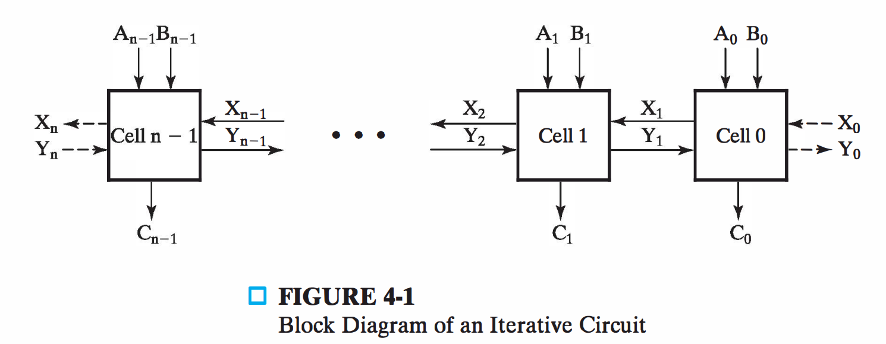

### 二进制加法器

- 半加器：2输入按位加功能模块 

  - 输入：X，Y 

  - 输出：和位S，进位C

| 真值表                                                       | 表达式                                                       | 实现电路                                                     | 卡诺图                                                       |
| ------------------------------------------------------------ | ------------------------------------------------------------ | ------------------------------------------------------------ | ------------------------------------------------------------ |
| 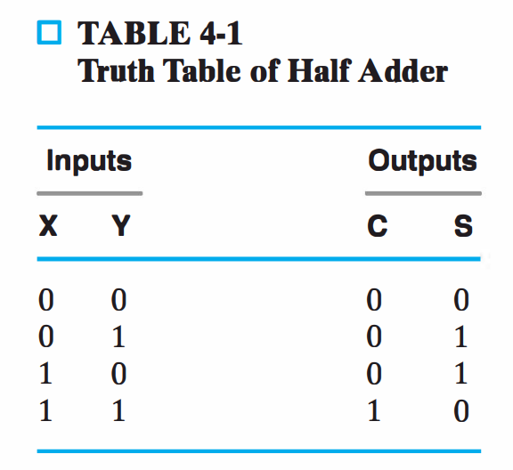 | 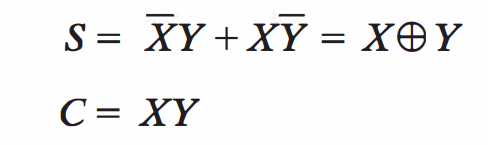 | 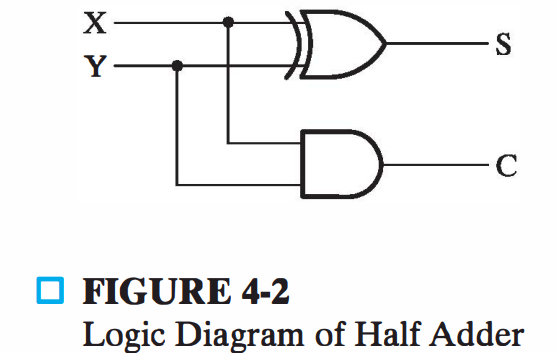 | 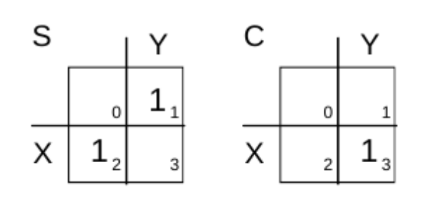 |

- 全加器：3输入按位加功能模块 

  - 输入：X，Y，进位Z 

  - 输出：和位S，进位C

  - S 是三位异或函数（奇函数） $S = X \oplus Y \oplus Z$

  - C是 $XY + (X \oplus Y) Z$

    - 项 $XY$ 是==进位生成== 

    - 项 $X \oplus Y$ 是==进位传播== 

| 真值表                                                       | 卡诺图及表达式                                               | 实现电路                                                     |
| ------------------------------------------------------------ | ------------------------------------------------------------ | ------------------------------------------------------------ |
| 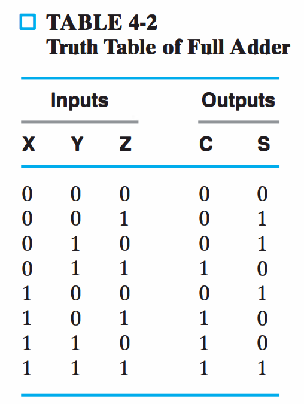 | 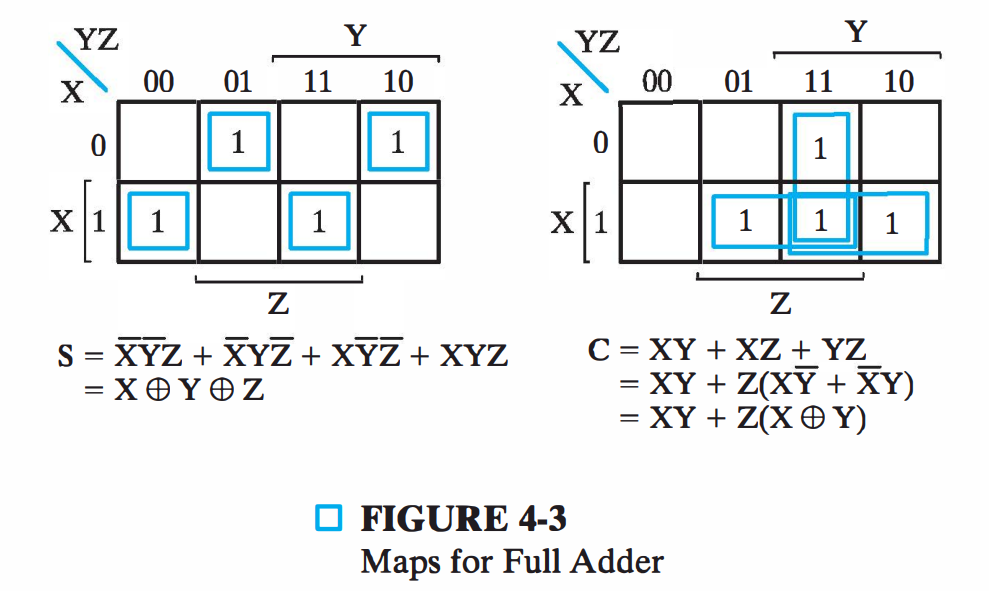 | 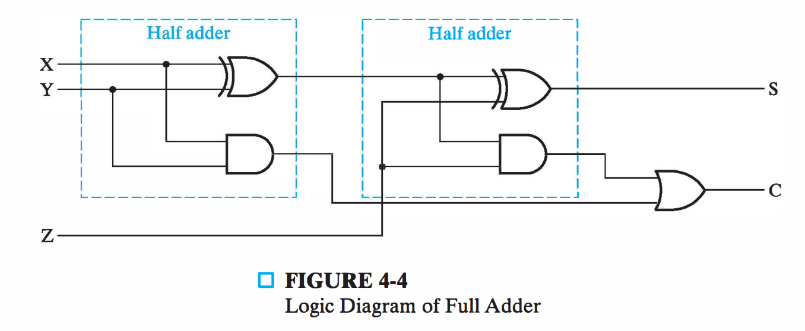 |

- 全加器概要图 

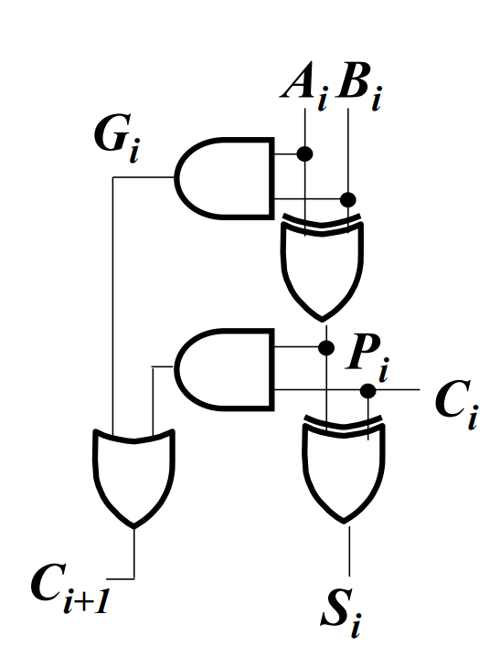

- 上面的X,Y,Z是这里的A, B, C 

- 同时 

➢ G = 进位生成 

➢ P = 进位传播 

- 组成 

➢ 两个半加器 

➢ 一个或门

- ==行波进位加法器==：二进制加法==迭代阵列==

- 4位行波进位加法器 

➢ 迭代阵列 ➢ 单元 ➢ 1位全加法器

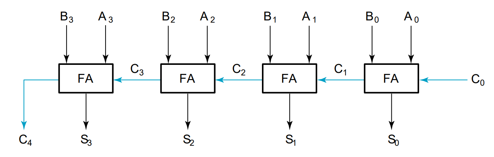

### 二进制减法器

- 二进制==补码== 

➢ B的补码为$2^n-B$ 

- 二进制==反码== 

➢ B的反码为$2^n-1-B$ 

➢ 按位取反 

- 二进制==补码== 

➢ 按位取反加1

- 减法可以按照==补码的加法==执行 

- $A-B$即是 

  - $A\ge B$
    - $2^n+A-B$ 
    - 即$A-B$真正的值

  - $A<B$
    - $2^n-(B-A)$
      - 得到$B-A$的补码

- ==无符号数==加减运算规则 

- 采用==符号-补码表示==有符号数运算规则 

- 两者一致

- 电路如图所示，计算A+B和A-B 

➢ S=1，减法 

➢ S=0，加法

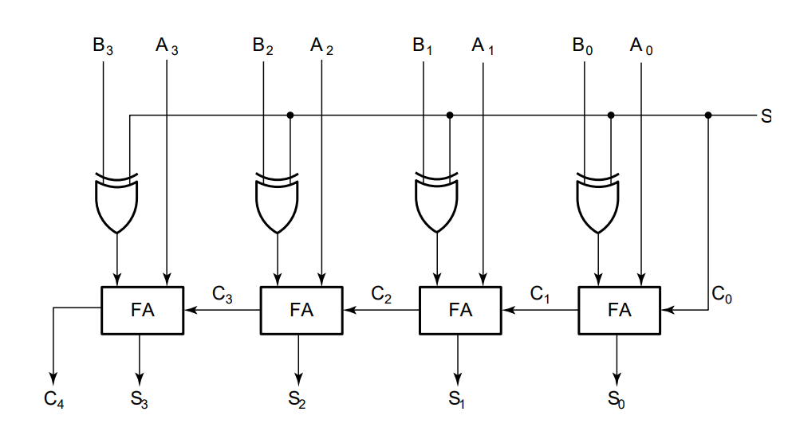

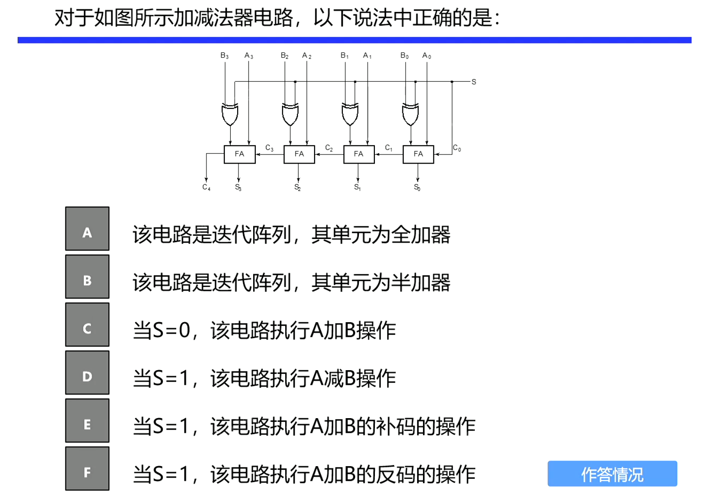

> ACDE

- 溢出 

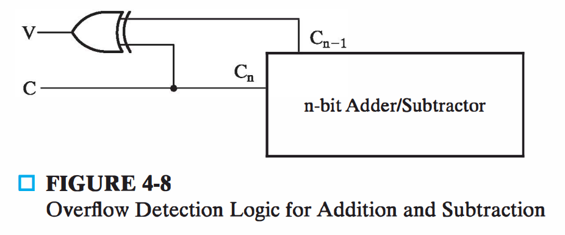

➢ 进位$C_n$

➢$V = C_n \oplus C_{n-1}$ 

- 无符号数 unsigned

  - 加法 

    - $C_n$为1发生溢出 

    - $C_n$为0无溢出 

  - 减法 

    - $C_n$为1：结果为正，无需校正 

    - $C_n$为0：结果为负数补码，需要校正

- 有符号数signed（符号-补码） 

  - V=0，无溢出 

  - V=1，有溢出，表明运算结果有n+1位，溢出位为符号位

### 其他算术模块

- 压缩 

  - 针对特定应用将已有电路化简成一个==简单电路== 

  - ==简化电路设计==, 代替直接设计电路 

  - 通过将输入端的值==固定、传递和取反== 

  - 将==未使用的输出端置==为X 
    - 该输出门和仅驱动该输出门的门==可移去==

- 递增器（将上面的全加器改成三位，并将一些输入值固定）

➢ $C_0=0$ 

➢ $B_0=1~B_1=0~B_2=0$ 

➢ $C_3=X$

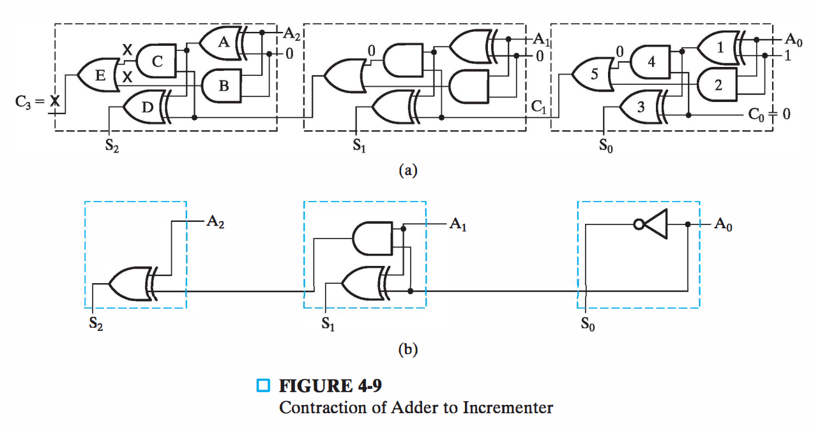

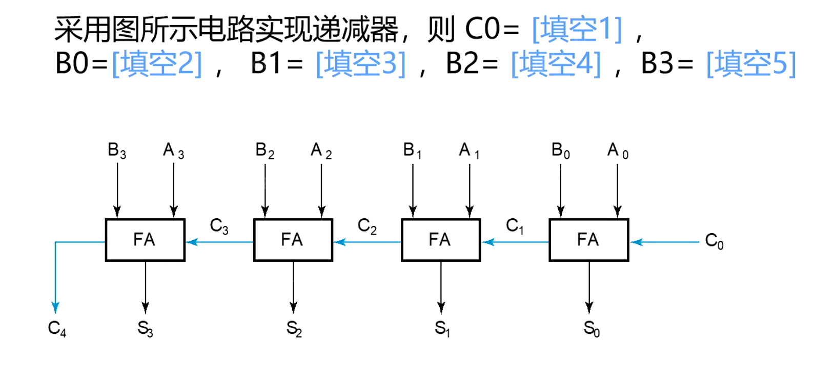

> 若利用加法器实现的话
>
> C0 = 0
>
> B[3:0] = $0001 \oplus 1 + 1$  = $1111$
>
> 或减法器
>
> C0 = 1
>
> B[3:0] = $0001 \oplus 1$ = $1110$
>
> 总而言之就是B0和C0有且仅有一位为0即可，其它全为1
>
> 其实可以看到，一个二进制数和1异或就是反码，和0异或就是本身；

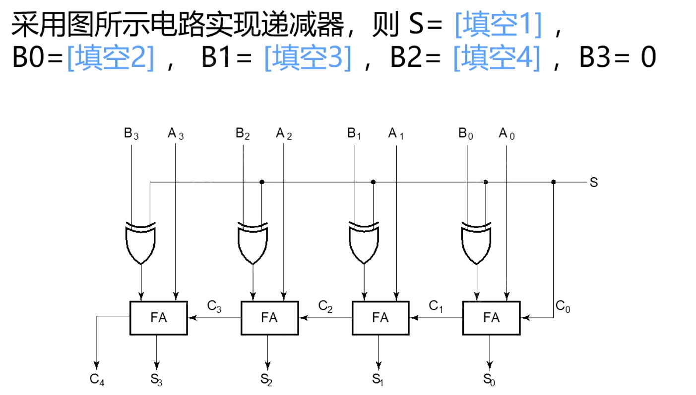

> S=1
>
> B[3:0] = 0001 

- 递减器

| 实现方法一                                                   | 实现方法二                                                   |
| ------------------------------------------------------------ | ------------------------------------------------------------ |
| 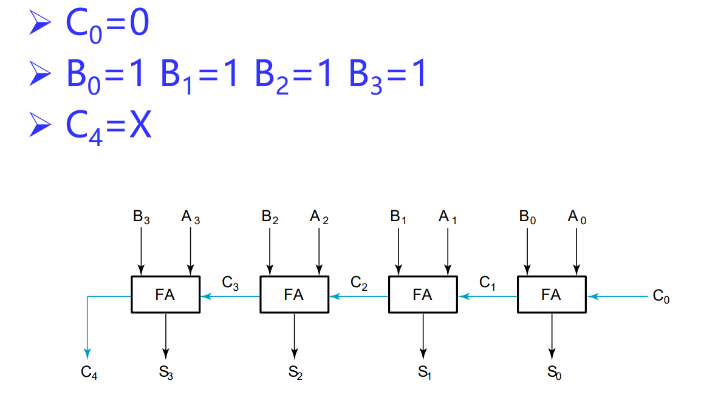 | 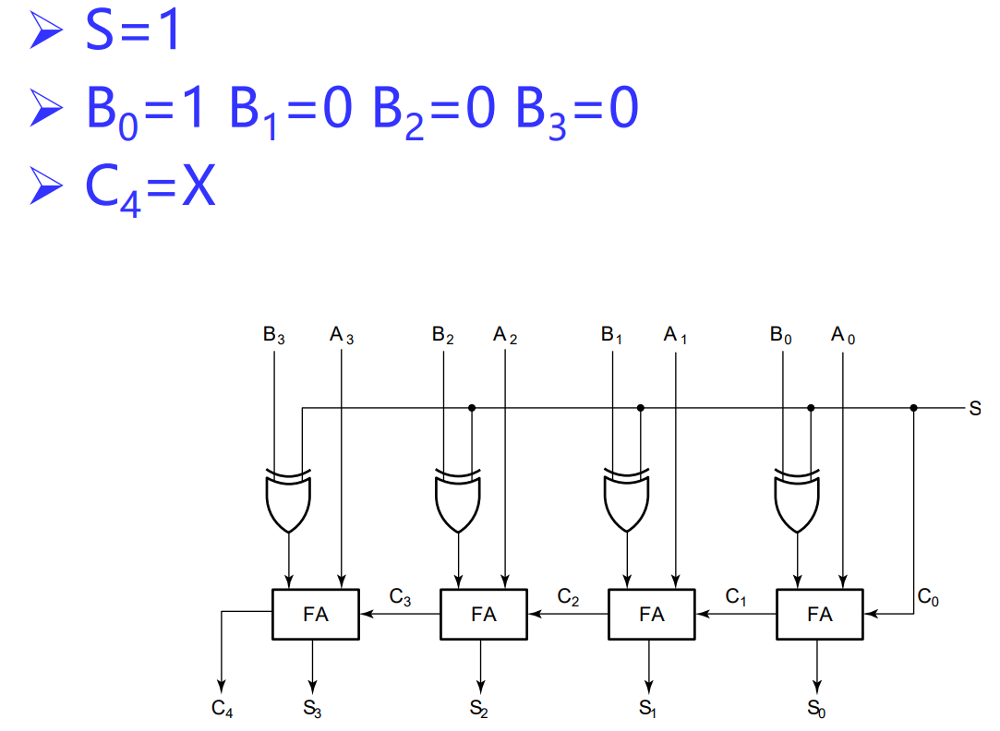 |

- 常数乘法与除法

| 乘以100（左移2位）                                           | 除以100（右移2位）                                           |
| ------------------------------------------------------------ | ------------------------------------------------------------ |
| 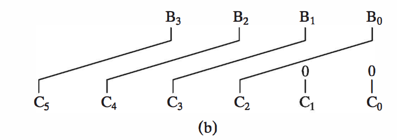 | 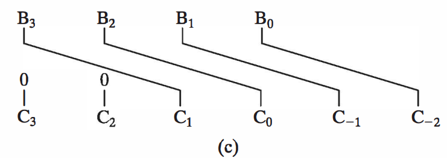 |

| 乘以 101                                                     | 个人理解                                                     |
| ------------------------------------------------------------ | ------------------------------------------------------------ |
| 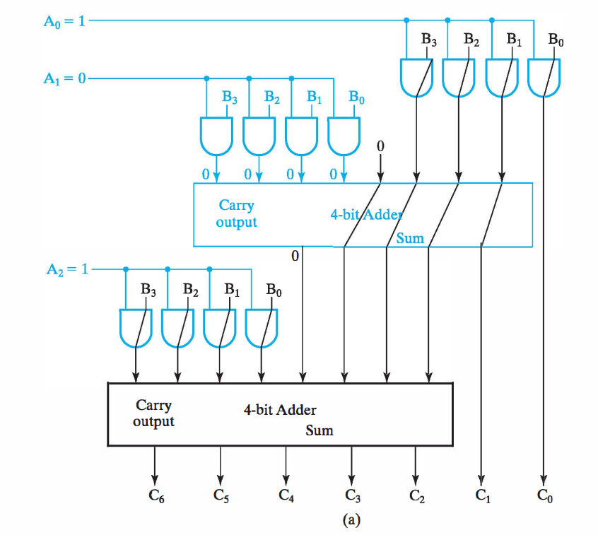 | 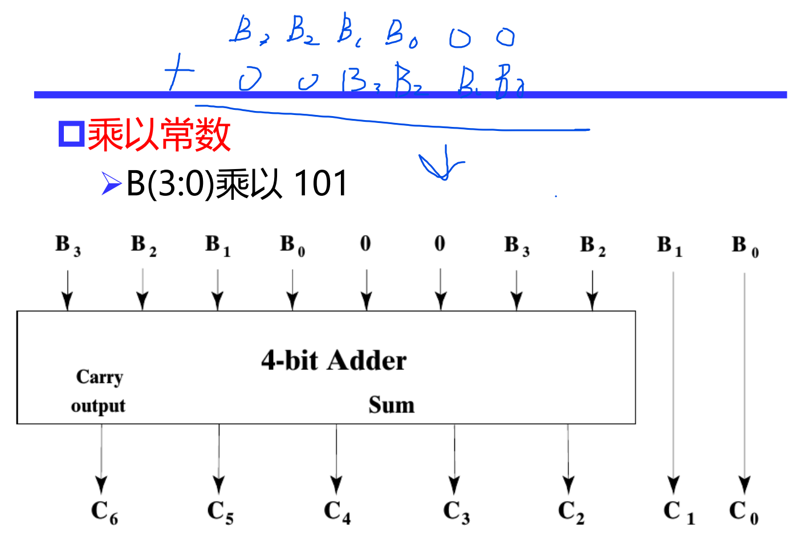 |

- 零扩充和符号扩展
- ==零填充==：用于==增加==操作数的==位数== 
- 11110101填充成16位 

➢ 左填充：==00000000==11110101 

➢ 右填充：11110101==00000000==

- ==符号扩展==：增加符号-补码表示符号数位数 

- 01110101 符号扩展到16位 
  - 0000000001110101 

- 11110101 符号扩展到16位 
  - 1111111111110101 
  - 还是原来的数（补码意义上）

- 11110101 零填充到16位 
  - 0000000011110101
  - 但不再是原来的数

> 就相当于这样理解符号扩展可以理解成最高位（符号位）是啥，就往左填充啥（一直填充够位数）