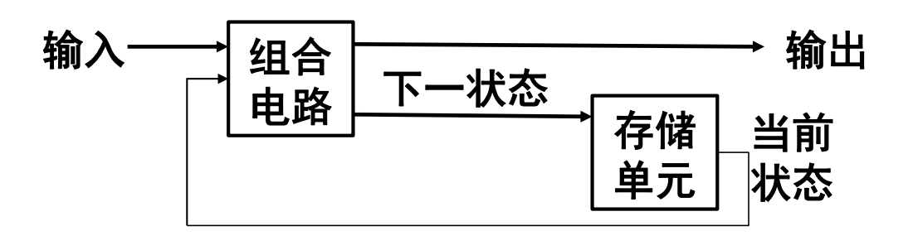
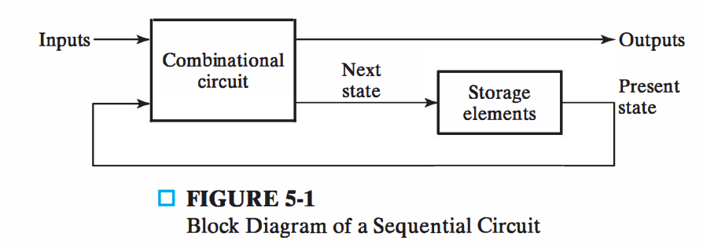
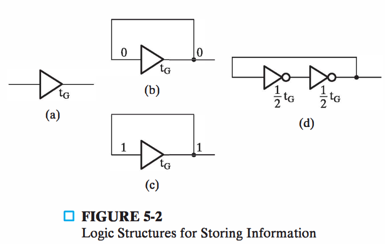
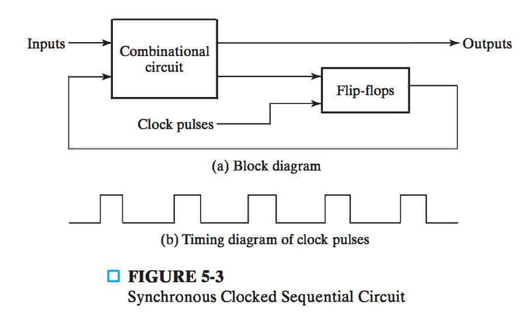

# 时序逻辑电路

- 时序电路 

  - 输出，不仅取决于当前输入，且与当前状态有关 

  - 构成 

    - 存储单元：实现状态存储的电路 

    - 组合逻辑：转换函数

| 中                                                           | 英                                                           |
| ------------------------------------------------------------ | ------------------------------------------------------------ |
|  |  |

- 存储单元 
  - 锁存器/触发器: ==基于电路延时== 

| 存储信息的逻辑结构                                           | 同步时序电路                                                 |
| ------------------------------------------------------------ | ------------------------------------------------------------ |
|  |  |

- 组合电路 

  - 下一状态函数 
    - Next State = f(Inputs, State) 

  - 输出函数 

    - Outputs = g(Inputs, State) （Mealy） 

    - Outputs = h(State) （Moore）

- 时序电路类型 

  - 同步：全局时钟，存储单元状态改变只发生在全局时钟到来时 
    - 由一个时钟统一控制存 储元件，状态只会在时钟上升 /下降的边沿发生
    - ==触发器==是基本存储元件

  - 异步：任何时刻可以改变存储单元状态 
    - 状态可以在任意时间发生变化 
    - ==锁存器==是基本存储元件

- 另一视角 

  - 将时钟看作一个输入，则所有电路异步 

  - 但，同步电路更易分析和设计

