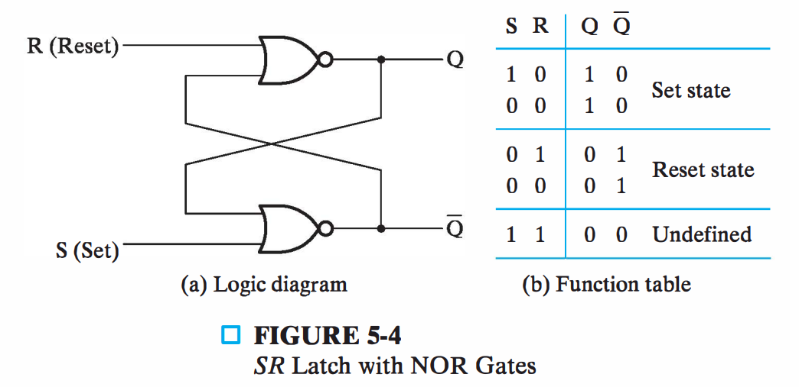

# 一、存储单元

## 状态存储

- 如何让电路能够存储状态？ 
  - 利用电路延时 

- 门延时模型 

  - 设门延时为 0.2 ns, 0.4 ns, 0.5 ns 

  - 可表示为

| 非                                                           | 与                                                           | 或                                                           | 2-1多路复用器                                                |
| ------------------------------------------------------------ | ------------------------------------------------------------ | ------------------------------------------------------------ | ------------------------------------------------------------ |
|  |  |  |  |

- 电路函数 

  -  Y = A for S = 0 

  -  Y = B for S = 1 
- S变为1：A1.1ns 消失，B 0.9 ns到达 
- S变为0：A1.1ns 到达，B 0.9 ns消失 
- 毛刺: 反相器延迟导致两个与门都关闭(或打开)
  - 一般在0.2到0.5ns内

| 2-1多路复用器                                                | 定时图                                                       |
| ------------------------------------------------------------ | ------------------------------------------------------------ |
|  |  |

- A直连Y 

- 电路函数 

  - Y = B for S = 1 

  - Y(t) =Y(t – 0.9) for S = 0 

- 此时电路变成时序电路 
  - 因为输出是输入信号时序函数

> 也就是说只要函数输入中有t就会变成时序电路

| 将A直连Y，变成时序电路                                       | 定时图（阴影部分为Y值保持信号重复阶段）                      |
| ------------------------------------------------------------ | ------------------------------------------------------------ |
|  |  |

- 输入信号每100ns改变一次 

  - 100ns vs 0.5ns  

  - 门延时可忽略 

- Y 不仅是输出，更是状态

| 时序电路                                                     | 时序变化                                                     |
| ------------------------------------------------------------ | ------------------------------------------------------------ |
|  |  |

- 加入1个反相器 

- S=0时 

  - 振荡器 

  - 可作为原始时钟

| 加入反相器时序电路                                           | 时序变化                                                     |
| ------------------------------------------------------------ | ------------------------------------------------------------ |
|  |  |

> A 存在，无论输入信号改变的周期有多长，毛刺的存在是因为各元器件的门延迟导致的，所以还会有毛刺

## 锁存器

|                           SR Latch                           |              $\overline{S}~\overline{R}$  Latch              |
| :----------------------------------------------------------: | :----------------------------------------------------------: |
|  |  |
|                    S为1时Q为1，为0时Q保持                    |                    S为0时Q为1，为1时Q保持                    |
|  |  |

|                    SR Latch with Control                     |                           D Latch                            |
| :----------------------------------------------------------: | :----------------------------------------------------------: |
|  |  |
|       C为0的时候保持原来信号，为1 的时候相当于SR Latch       |   C为0的时候保持原来信号，为1的时候D为0则Q为0，D为1则Q为1    |
|                              -                               |  |

### $\overline{S}\text{-}\overline{R}$锁存器 

| $\overline{S}~\overline{R}$ 锁存器电路                       | 时序变化                                                     |
| ------------------------------------------------------------ | ------------------------------------------------------------ |
|  |  |

-  $\overline{S}\text{-}\overline{R}$锁存器 

  - ==交叉耦合==的两个==与非门== 
  - 一半为0，一半为1 

- 名称: Set / Reset 

  - 取反：==0有效== 

- S=1, R=1 保持 
- S=0, R=1 置位 
- S=1, R=0 复位 
- ==S=0, R=0== ==禁止== 

  - 两输出为1，不合逻辑 

  - 回到S=1, R=1, S, R不完全同步, 结果不可预测

### S-R锁存器 

| S-R锁存器电路                                                | 时序变化                                                     |
| ------------------------------------------------------------ | ------------------------------------------------------------ |
|  |  |

- S-R锁存器 

  - 交叉耦合的两个==或非门== 

  - 一半为0，一半为1 

- 名称: Set / Reset 
  - 取反：==1有效== 

- S=0, R=0 保持 

- S=1, R=0 置位 

- S=0, R=1 复位 

- ==S=1, R=1 禁止== 

  - 两输出为0，不合逻辑 

  - 回到S=0, R=0, S, R不完全同步, 结果不可预测

### 时钟S-R锁存器 

| 时钟S-R锁存器                                                | 时序变化                                                     |
| ------------------------------------------------------------ | ------------------------------------------------------------ |
|  |  |

- 时钟S-R锁存器 

  - 向$\overline{S}\text{-}\overline{R}$锁存器添加时钟使能 

  - ==当C=1时,== S和R才有效 

  - C: Control或者Clock都可以

- C=1 时 
  - S-R锁存器 （注意因为取反了输入到$\overline{S}\text{-}\overline{R}$锁存器中所以相当于S-R锁存器）

- C=0 时 
  - 保持状态 

- 时序行为 

  - 基于 t 时 
    - S, R 
    - Q(t) 

  - t+1: 下个时钟
    - Q(t+1)

### D锁存器

| D锁存器                                                      | 时序变化                                                     |
| ------------------------------------------------------------ | ------------------------------------------------------------ |
|  |  |

- D锁存器 
  - 时钟S-R锁存器加==反相器== 
- 名称意义 
  - Data 
- C=1时 

  - D=1: S=1, R=0 

  - D=0: S=0, R=1 
- C=0 时 
  - S=0，R=0 

> B无

## 触发器

|                  SR Master-Slave Flip-Flop                   |             Negative-Edge-Triggered D Flip-Flop              |             Positive-Edge-Triggered D Flip-Flop              |
| :----------------------------------------------------------: | :----------------------------------------------------------: | :----------------------------------------------------------: |
|  |  |  |
|  |  |  |

### 锁存器缺陷

| 考虑这种电路                                                 | 问题                                                         |
| ------------------------------------------------------------ | ------------------------------------------------------------ |
|  |  |

- 初始Y=0, 则 会出现问题

  - 问题：C=1时， Y持续改变，最终状态不确定 

  - 而我们希望：1次时钟，Y改变1次 

  - 问题原因：Y到Y回路的延迟

- 一般情况，存在通过组合电路的回路 

  -  1个锁存器到另外1个锁存器 

  -  1个锁存器到自身 

- C=1时，输入改变，引起锁存器输出持续改变

- 怎么办？ 

  -  切断Y到Y的路径 

  -  即采用==触发器取代锁存器==

### 主从触发器 

| 主从触发器                                                   | 触发条件（C信号波形）                                        |
| ------------------------------------------------------------ | ------------------------------------------------------------ |
|  |  |

- 主从S-R触发器 

  - 包含==两个时钟S-R锁存器== 

  - 左边，主；右边，从 

  - 第二个锁存器的==时钟反相== 

- 回路被时钟的==不同值切断== 
  - 保持只有1个锁存器有效

- 又叫脉冲触发器 

  -  有脉冲时，主锁存器状态改变 （在上图中就是C为红色高电平区间内都可改变主锁存器状态）

  -  无脉冲时，从锁存器状态改变（在C为蓝色低电平区间内都可改变从锁存器状态）

- 脉冲触发器问题 
  - 易受干扰信号影响 

- 例子 

  - 初始状态为0 

  - 无干扰时 

    -  有脉冲时：S=0, R=0 

    -  无脉冲时：Q=0 

  - 有干扰时 

    -  有脉冲时：S=0, R=0；S=1 (尖峰干扰)；S=0  

    -  无脉冲时：Q=1

- 怎么办？ 
  - 采用边沿触发代替脉冲触发

| 脉冲触发                                                     | 边沿触发                                                     |
| ------------------------------------------------------------ | ------------------------------------------------------------ |
|  |  |

### 边沿触发器 

| 主从S-R触发器                                                | 负边沿D触发器                                                | 正边沿D触发器                                                |
| ------------------------------------------------------------ | ------------------------------------------------------------ | ------------------------------------------------------------ |
|  |  |  |

- 边沿D触发器 

  - 将主从S-R的==主锁存==换成==D锁存== 

  - 输出改变由负边沿触发 （上上图中蓝色箭头）

  - 称为==负边沿D触发器==

- 主从S-R触发器 vs 边沿D触发器 

  - 主从S-R触发器：状态由==脉冲有效的时间段==决定 

  - 边沿D触发器：状态由==边沿的一瞬间==决定

- 正边沿D触发器 

  - 给时钟加==反相器== 

  - Q 在正边沿改变 （上上图中红色色箭头）

  - 标准触发器

### 直接输入

-  当启动或Reset,时序电路全部或部分需初始化 

-  独立于时钟，==异步输入== 

-  1表示依赖关系 

-  具备==直接置位和复位功能==的正边沿D触发器

## 标准符号

| 锁存器和触发器标准图形符号                                   | comment                                                      |
| ------------------------------------------------------------ | ------------------------------------------------------------ |
|  |  |

> 锁存器和触发器和主从触发器的区别在于输入C处有没有一个小小的三角形，有种trigger的意思以及后面有没有直角符号，有直角的是主从触发器，有三角形的是边沿触发器，啥都没的是锁存器；

> 选B
>
> 不难看出上面时两个D锁存器所组成的一个简单电路，其实这个电路和那个Negative-Edge-Triggered D Flip-Flop所起到的作用都是一样的，就是在时钟的负边缘触发信号操作，只不过之所要做成D锁存器和时钟S-R锁存器连接起来是因为这样可以减少原来组成D触发器的一个不必要的操作；

> BE

> 选AD

> 选AF

> 自己的做法（$Q_0$做错了）：
>
> 
>
> 在最后时钟信号没有的时候应该保持，正确答案如下：
>
> 