# 二、时序电路分析 

### 一般模型 

- 下一状态函数 
  - Next State = f(Inputs, State) 

- 输出函数 

  - Outputs = g(Inputs, State) （Mealy） 

  - Outputs = h(State) （Moore）

## 方程 Equations

- 输入: X 

- 输出: Y 

- 状态:$(D_A , D_B)$  

| 时序电路例子一                                               | 状态函数                                                     | 输出函数                                                     |
| ------------------------------------------------------------ | ------------------------------------------------------------ | ------------------------------------------------------------ |
| 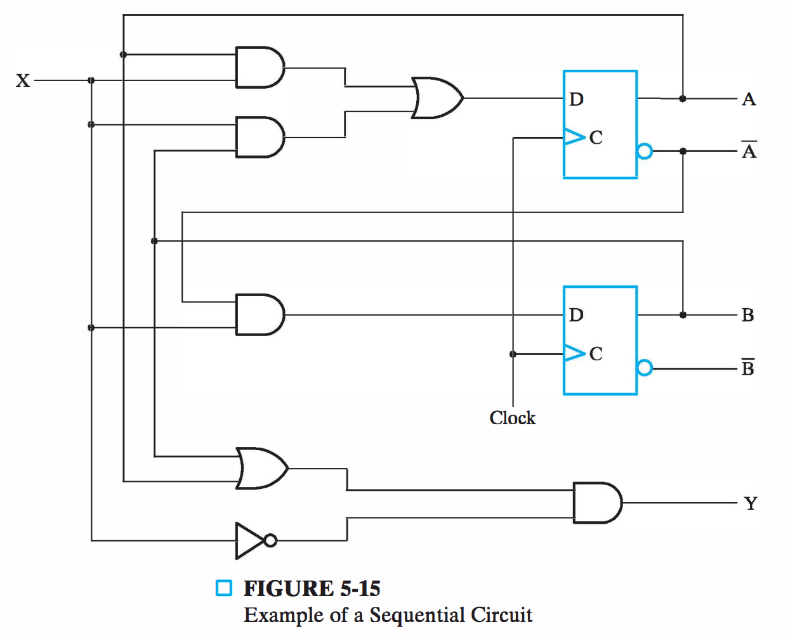 | 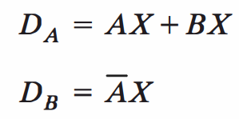 | 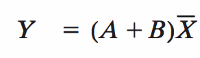 |

- 输入: X，Y

- 输出: Z

- 状态: A

| 时序电路例子二                                               | 状态函数                                                     | 输出函数                                                     |
| ------------------------------------------------------------ | ------------------------------------------------------------ | ------------------------------------------------------------ |
| 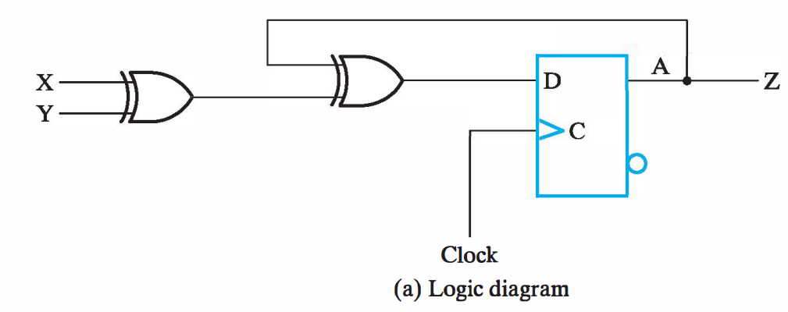 | 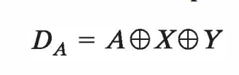 | 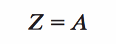 |

## 状态表 State Table

- 四个部分 

  - 当前状态: 状态变量合法值 

  - 输入: 合法输入组合 

  - 下一状态: 基于当前状态和输入的下一状态 

  - 输出: 基于当前状态和输入(可选)的输出 
- 可以视为真值表 

  - 输入: 当前状态+输入 
- 输出: 下一状态+输出

### 例子一

| Equations                                                    | State Table                                                  | 2D State Table                                               |
| ------------------------------------------------------------ | ------------------------------------------------------------ | ------------------------------------------------------------ |
| $A(t+1) = D_A = AX + BX \\B(t+1) = D_B = \overline{A}~X\\Y=\overline{A}~X+\overline{B}~X$ | 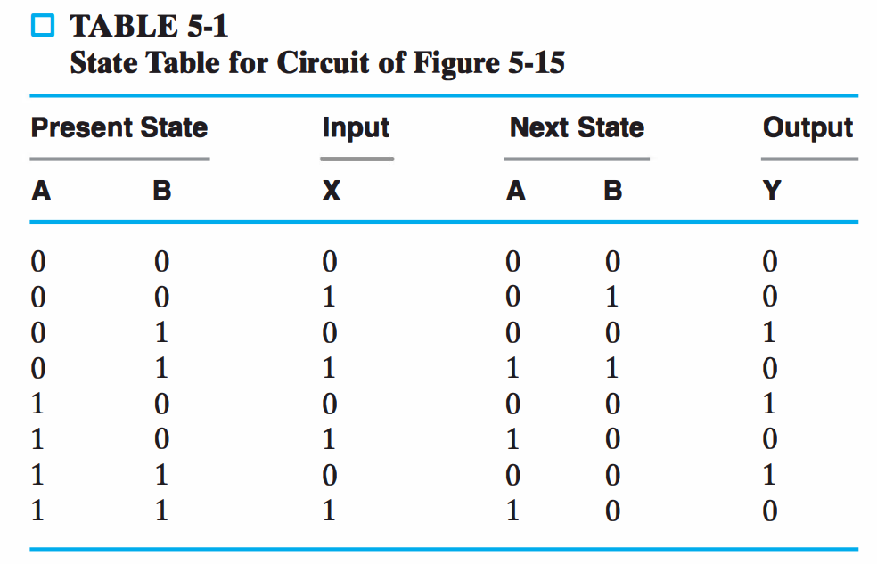 | 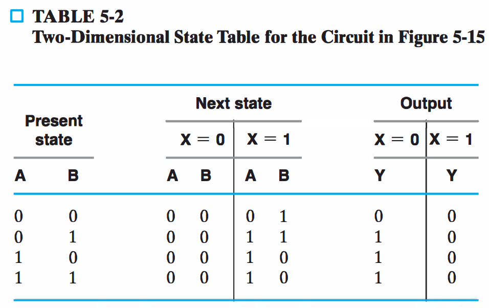 |

### 例子二

|              Equations               |                         State Table                          |
| :----------------------------------: | :----------------------------------------------------------: |
| $A(t+1)=D_A=A\oplus X \oplus Y\\Z=A$ | 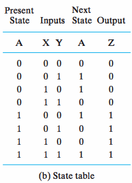 |

## 状态图 State Diagram

- 用图的形式表达时序电路函数 
- 状态： 用==圆圈⭕==表示 
- 下一状态函数：Next State = f(Inputs, State) 

  - 当前状态到下一状态弧线 

  - 弧线上标注输入，即转移条件 
- 输出函数：Outputs = h(State) （Moore） 
  - 状态上标注输出：==状态/输出== 
- 输出函数： Outputs = g(Inputs, State) （Mealy） 
  - 借用下一状态函数弧线：==输入/输出==

> 从上面的两个例子的方程我们也可以看到例子二的输出只和状态有关（$Z=A$），而例子一的输出和状态和输入都有关$Y=\overline{A}~X+\overline{B}~X$，所以自然而然的，根据状态表，下面我们可以画出例子一的Mealy型的状态图和例子二的Moore型状态图。
>
> 也可以直接从状态表里判断是Moore还是Mealy，如果状态表的output那一列下面又有X=0 X=1这种那么就是和输入有关，为Mealy型；

| 😗      |                            Moore                             |                            Mealy                             |
| ------ | :----------------------------------------------------------: | :----------------------------------------------------------: |
| 基本   | 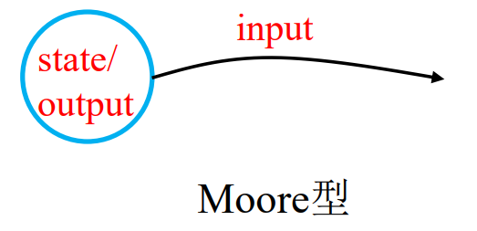 | 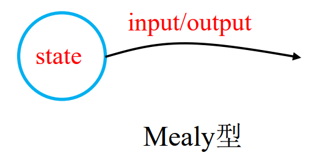 |

| 🍧      |                            Moore                             |                            Mealy                             |
| ------ | :----------------------------------------------------------: | :----------------------------------------------------------: |
| 状态表 | 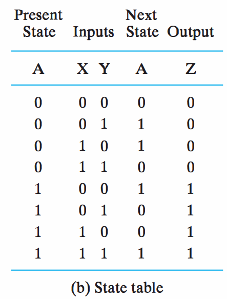 |  |

| 🍔      |                            Moore                             |                            Mealy                             |
| ------ | :----------------------------------------------------------: | :----------------------------------------------------------: |
| 状态图 | 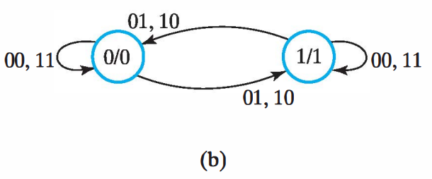 | 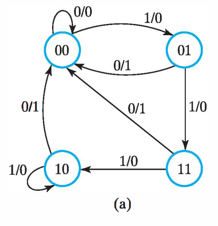 |

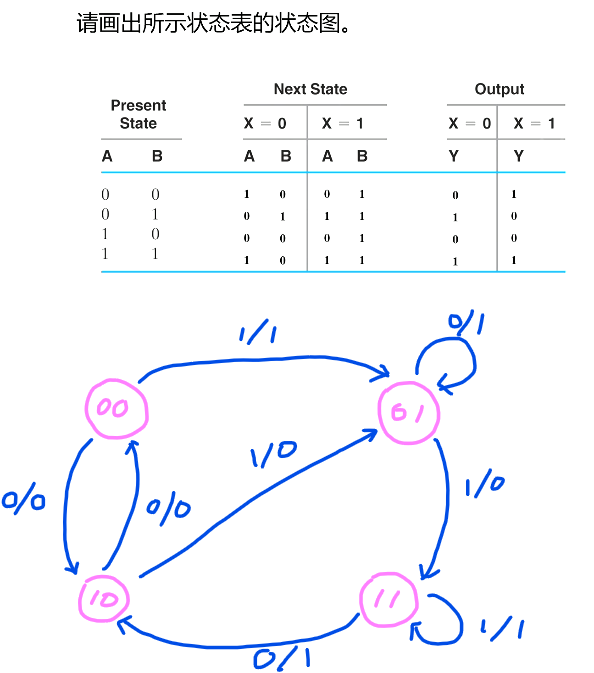

## 等价状态

- 等价状态 

  -  两个状态，对每一个输入 

     - 相同的输出 

     - 相同的下一状态 

  -  则这两个状态等价 

  - 对于下面图中的S2和S3 

    -  输入0 
       - 输出1，下一状态S0 

    -  输入1 
       - 输出0，下一状态S2 

  - S2和S3等价

- 等价状态可以合并为1个 
  - S2和S3合并为S2 

- 新状态图上，S1和S2 

  - 输入0 
    - 输出1，下一状态S0 

  - 输入1 
    - 输出0，下一状态S2 

  - S1和S2等价 

  - S1和S2合并为S1

|                           0.detail                           |                           1.状态图                           | 2.合并S2和S3                                                 | 3.合并S2和S1                                                 |
| :----------------------------------------------------------: | :----------------------------------------------------------: | ------------------------------------------------------------ | ------------------------------------------------------------ |
| 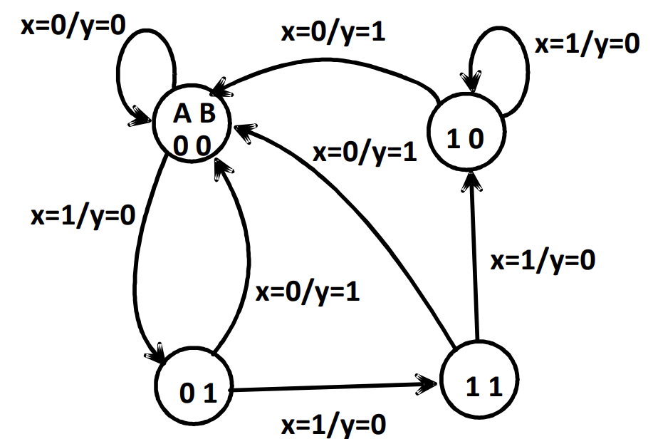 | 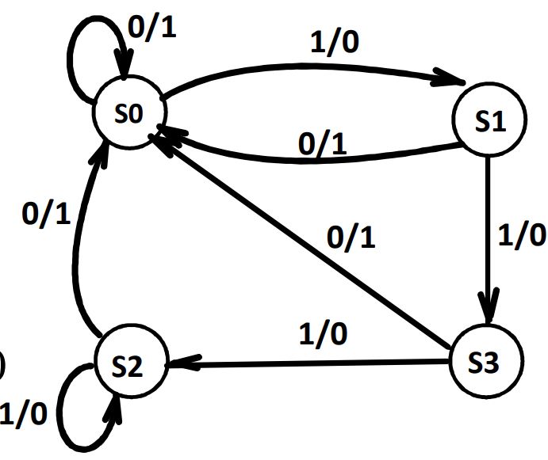 | 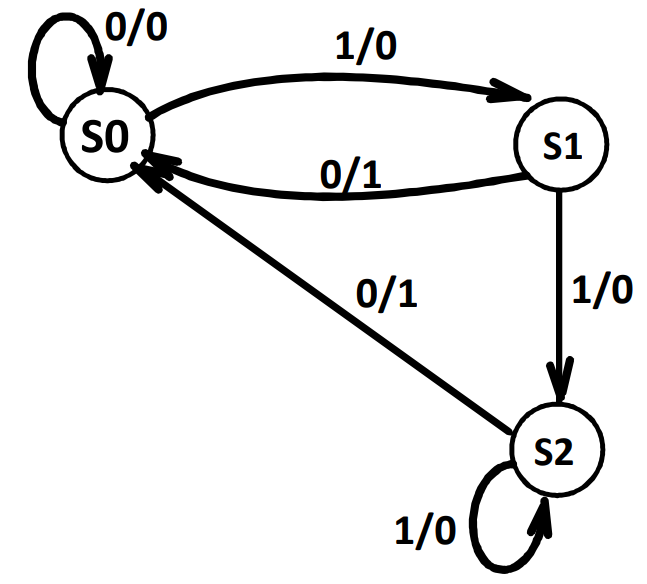 | 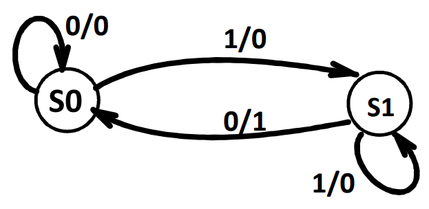 |

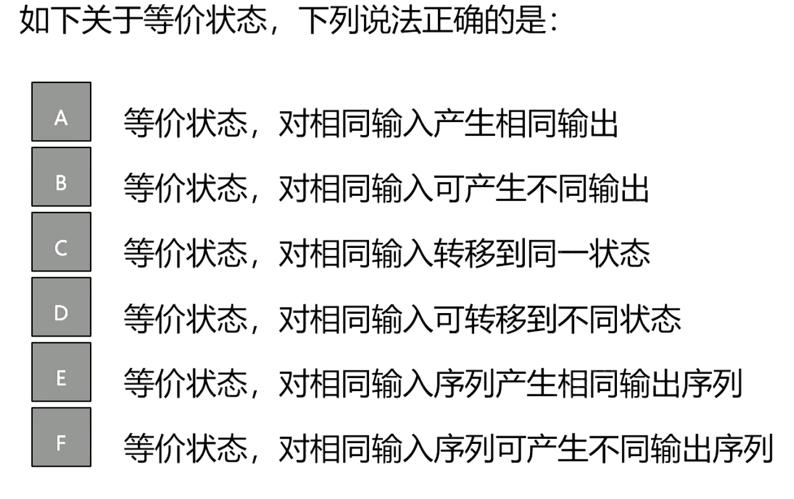

> ACE

## 输出类型

### 两种输出类型 

- Moore型 

  - Outputs = h(State) 

  - 状态上标注 

  - 状态/输出 

- Mealy型 

  - Outputs = g(Inputs, State) 

  - 转移弧上标注 

  - 输入/输出

### 改造状态表 

- Moore 型
  - 不包含输出条件 
- Mealy 型 
  - 包含输出条件

| 💨      | Moore例子                                                    | Mealy例子                                                    |
| ------ | ------------------------------------------------------------ | ------------------------------------------------------------ |
| 状态图 | 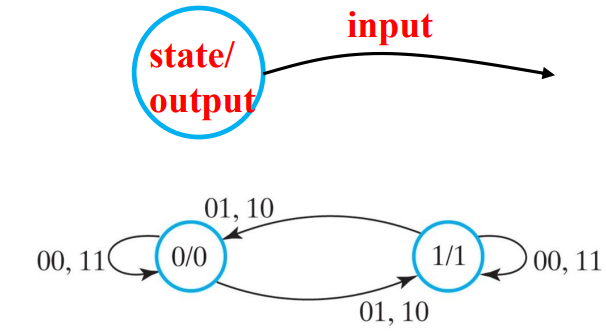 | 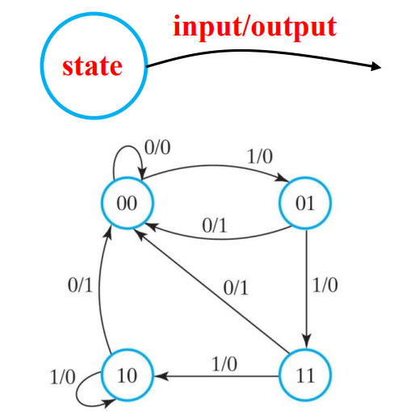 |
| 状态表 | 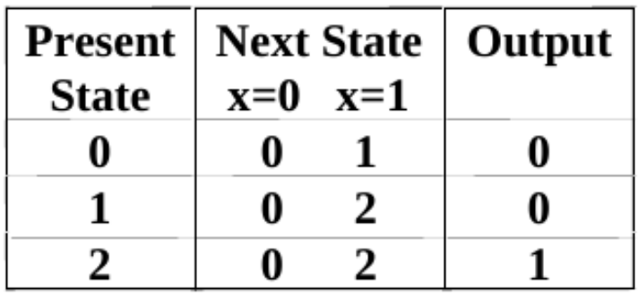 | 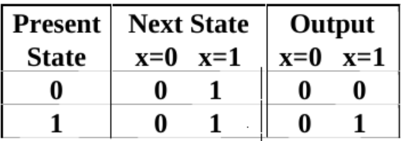 |

### 两种类型混合 

- 实际设计中, 有些输出Moore型，有些Mealy 

- 00上输出: Moore （因为观察到00的输出一定为0，所以把00/0写入状态的圈中）

- 01, 10, 和11上输出: Mealy

| Mealy型                                                      | 混合型                                                       |
| ------------------------------------------------------------ | ------------------------------------------------------------ |
| 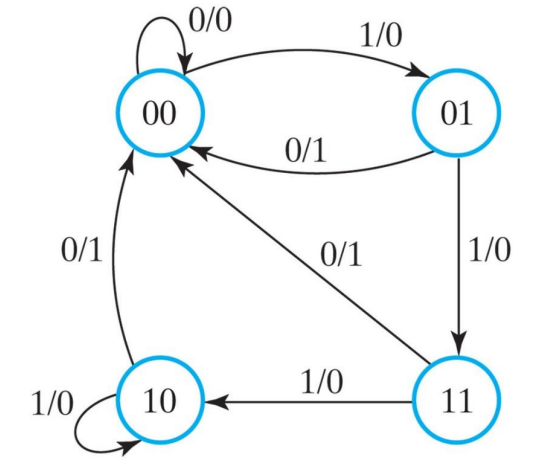 | 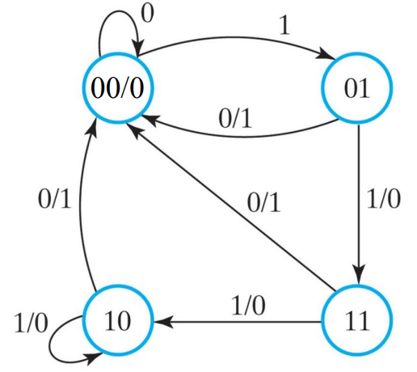 |

### Moore和Mealy 转换 

- 基本思想：Moore 输出比Mealy慢一拍 

  -  Moore：先转移到次态，在次态(行)输出(状态表) 

  -  Mealy: 转移同时输出，在本态(行)输出(状态表） 

#### Moore 到Mealy 

-  当前状态==输出==改为==输入弧上==输出
-  就是将状态圈中的`/output`移到所有指向自己的弧线上和`input`放在一起

| Moore                                                        | Mealy                                                        |
| ------------------------------------------------------------ | ------------------------------------------------------------ |
| 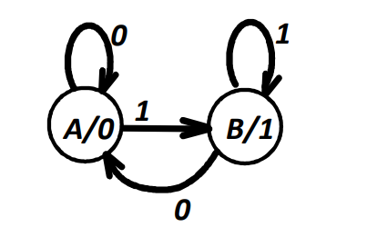 | 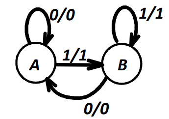 |

#### Mealy 到Moore 

- 输入弧上输出改为当前状态输出 （就是将弧上的`/output`移到所指的状态中去，和`state`放在一起）

  - 当前状态输入弧上输出一致，直接修改 

  - 当前状态输入弧上输出不一致，增加状态 

    - 一个状态对应一个输出 

    - 不同状态：不同输入弧，相同输出弧

| Mealy                                                        | Moore                                                        |
| ------------------------------------------------------------ | ------------------------------------------------------------ |
| 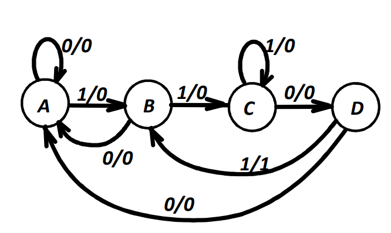 | 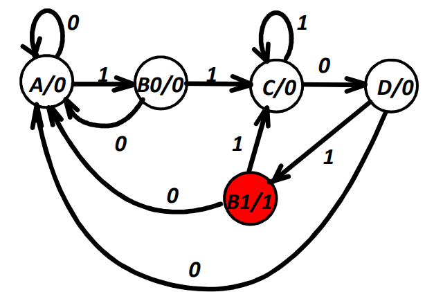 |

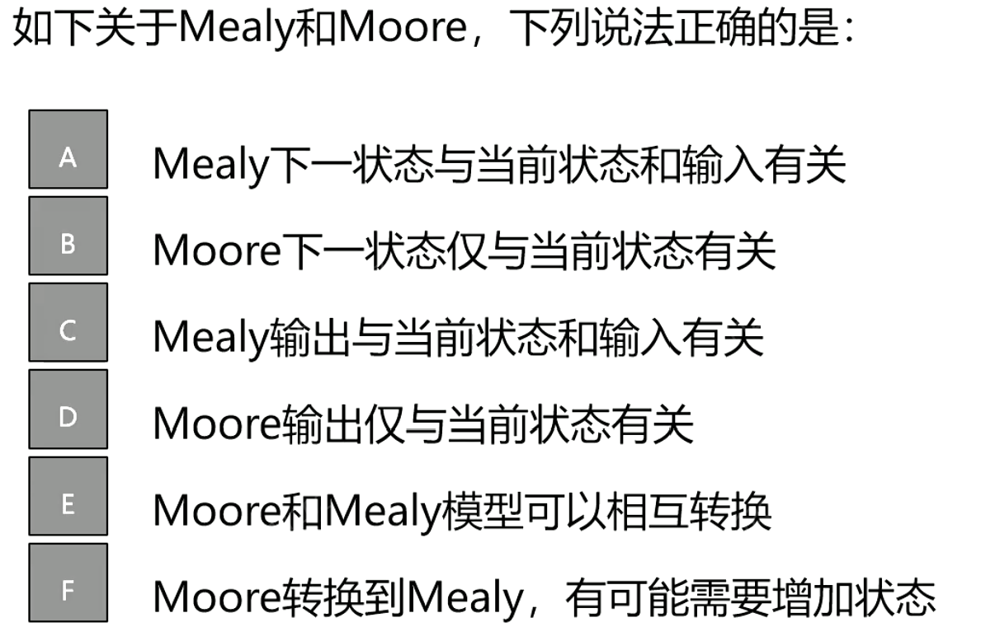

> ACDE
>
> Mealy到Moore由于要把弧上的输出拿到和state放在一起，所以有可能产生新的状态；（对状态操作）
>
> 从Moore到Mealy只需要将state叛变的输出拿出来给指向该状态的每一个弧即可，无新状态产生；（对弧操作）
