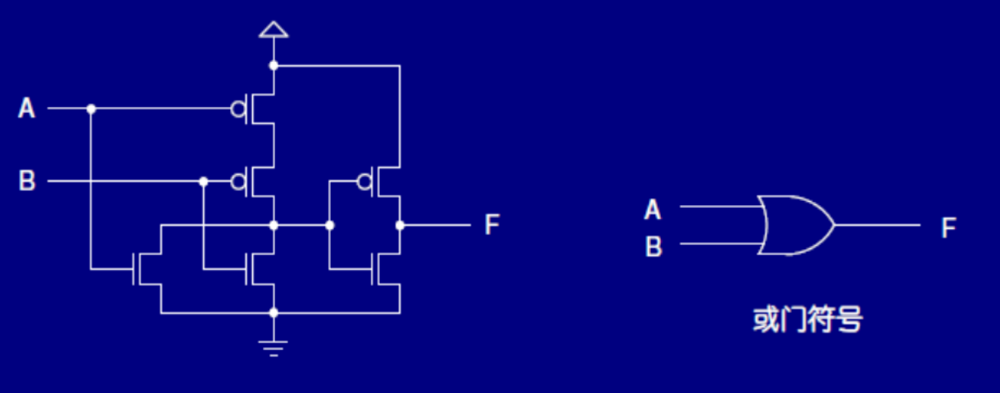
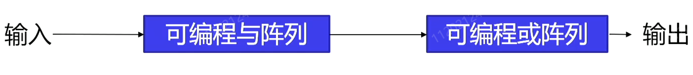

# 数字硬件实现

- 数字电路用==集成电路==构建而成 

- 集成电路：Integrated Circuit，IC 

- IC是一种硅半导体晶体，俗称==芯片==，包含实现==逻辑门和存储单元==的电子元件

- 芯片采用陶瓷或塑料封装，由内部电路引出与外 部电路相连的==接线（引脚）== 

- 引脚构成了芯片的==接口==

## 一、CMOS电路工艺

### CMOS

- 集成电路可根据==工艺==划分，CMOS占据统治地位 

- ==C==MOS：基于硅的==互补==氧化物半导体工艺 

  - 特点：高密度、高性能、低功耗 

  - 基础是MOS晶体管 

  - MOS: 金属氧化物半导体 

- 包含==两种类型==的晶体管 

  - n沟道MOS 

  - P沟道MOS

- n 沟道MOS晶体管原理：可以模型化成开关 

  - 通常漏极电压高于源级 

  - ON： 当栅极比源级电压==高出阈值== 

  - OFF：当栅极比源级电压差==低于阈值==

> 给n沟道的栅极施加一个电压（高电平），那么就相当于是导通的：
>
> - X=1时，电路是导通的；
> - X=0时，电路相当于时关闭的；
> - 常开的意思就是没有施加电压就认为X=0

### 开关模型

> 电路状态跟X一致的就叫n沟道（或者说电路状态跟电压信号一致的就叫n沟道）
>
> 而且可以从下面的具体例子中看到n沟道和p沟道的的不同，自己画图的时候也要注意
>
> - n沟道中间为$X:X$，两者一致
> - p沟道中间为$X:\overline{X}$，两者不一致

| 类型                                                | 例子                                                         |
| --------------------------------------------------- | ------------------------------------------------------------ |
| ==n沟道==：栅极（G）、源极（S）、漏级（D） ==常开== |  |
| ==p沟道==：源级和漏级互换，行为和n沟道相反==常闭==  |  |

### 开关电路

| 类型                                     | 例子                                                         |
| ---------------------------------------- | ------------------------------------------------------------ |
| 串行：$XY$， $\overline{X}~\overline{Y}$ |  |
| 并行：$X+Y$                              |  |

| 问题                                                         | 我的答案                                                     |
| ------------------------------------------------------------ | ------------------------------------------------------------ |
|  |  |

### 完全互补的CMOS门结构

> C就是互补的意思
>
> 我们要把两部分一样功能的互补电路连接起来

- 对偶结构 

  - n 沟道 vs. p沟道 

  - 串联 vs. 并联 
- p沟道传输1能力强：原函数 
- n沟道传输0能力强：反函数 
- 设计时 

  - ==先设计n沟道==：不带反变量 （但我们需要先得到目标函数的反函数再设计n沟道）

  - 再通过对偶原则p沟道
- CMOS门结构设计 

| 0. 目标函数                                                  | 1. 得到反函数                        |
| ------------------------------------------------------------ | ------------------------------------ |
| $F = \overline{X}Z+\overline{Y}Z=(\overline{X}+\overline{Y})Z$ | $\overline{F} = X Y + \overline{Z} $ |

| 2. n沟道常开开关实现                                         | 3. 通过==对偶原则==p沟道常闭开关实现                         | 4. 综合                                                      | 5. 替换                                                      |
| ------------------------------------------------------------ | ------------------------------------------------------------ | ------------------------------------------------------------ | ------------------------------------------------------------ |
|  |  |  |  |

- CMOS电路一般是==取反==的形式 （比如下面实现的都是啥非门）
  - 因其结构简单 

- 复合门：比与非门、或非门、非门复杂的电路

| 通用设计结构                                                 | 或非                                                         | 与非                                                         | 非门                                                         |
| ------------------------------------------------------------ | ------------------------------------------------------------ | ------------------------------------------------------------ | ------------------------------------------------------------ |
|  |  |  |  |
| 对于上面的图a，我们的上面的p沟道用来实现逻辑1，下面的n沟道用来实现逻辑的0。 | 观察下面的n沟道，我们可以看到$G_2=X+Y$，观察上面的p沟道，我们同样可以得到$G_1=\overline{X}~\overline{Y}=\overline{X+Y}$，两者互补 | 观察下面的n沟道，我们可以看到$G_2=XY$，观察上面的p沟道，我们同样可以得到$G_1=\overline{XY}$，两者互补 | 观察下面的n沟道，我们可以看到$G_2=X$，观察上面的p沟道，我们同样可以得到$G_1=\overline{X}$，两者互补 |

> 重新理解这种电路，实质上就是这相当于一个选择器将上面的"逻辑1"，和接地的"逻辑0"选择输出，而具体的选择功能是由逻辑电路来实现的，也就是说从输入端X到F是不导通的，X只是起负责控制CMOS的作用，而真正导通的是逻辑0或逻辑1于输出端F的电路，也就是说只要

> 古早PPT

|                              👇                               |                              👇                               |
| :----------------------------------------------------------: | :----------------------------------------------------------: |
|  |  |
|  |  |
|           👆可以看到是在与非门后面又加了一个反相器            |           👆可以看到是在或非门后面又加了一个反相器            |
|  | 在CMOS实现与或门这些电路上，实现与非、或非和非这些电路要比实现与门、或门、甚至是自己本身还要简单得多，这也就不难理解了之前为什么做工艺映射是这样操作了。 |

###  工艺参数

- ==工艺参数==：表征实现工艺的参数 

- ==扇入==：一个门可能的输入数 

  - 通常不超过4~5个 

  - 大扇入门==使用低扇入门连接==而成 

- ==扇出==：一个门输出驱动的标准负载数 

- ==成本==：晶体管大小、数目等因素

- 传统的实现是==固定==的 

  - ==一次性成本高== 

    - 适用于==大规模生产== 

    - 不适用于==小规模生产== 

- 可编程逻辑器件（PLD） 

  - ==包含==：实现逻辑功能的结构 

  - ==可编程==：以实现功能，是==硬件过程==

## 二、可编程实现技术

### 编程技术

- 可编程实现技术 

  - 固化编程 

    - 熔丝 

    - 反熔丝 

    - 掩膜编程 

  - 可重复编程 

    - 编程点的存储单元：易失性 

    - 晶体管开关：不易失性

- 晶体管开关 

  - 光可擦除：采用紫外线照射进行擦除 

  - 电可擦除：采用高于正常值电压擦除 

  - 闪存技术：电可擦除技术，支持多擦除选项

    - 单个浮动栅极 

    - 所有浮动栅极 

    - 浮动栅极特定子集

### 可编程器件

- 在组合电路中，经过卡诺图优化后，一般可以将输出表达成积之和，如： 

- 因此，要实现组合电路，需要： 

  - 与门阵列 

  - 或门阵列

| 常规符号                                                     | 阵列逻辑符号                                                 |
| ------------------------------------------------------------ | ------------------------------------------------------------ |
|  |  |

> :fish:上面两者等价

| 可编程器件            | detail                                                       |
| --------------------- | ------------------------------------------------------------ |
| 只读存储器（ROM）     |  |
| 可编程阵列逻辑（PAL） |  |
| 可编程逻辑阵列（PLA） |  |

> 不需要去记

### 只读存储器（ROM）

- 由译码器提供最小项 

- 可编程或阵列 

- 无需电路优化：电路成本最高 

- 两个角度理解

|                            角度一                            |                            角度二                            |
| :----------------------------------------------------------: | :----------------------------------------------------------: |
|  |          |
|  |  |
| 相当于一个5输入的组合逻辑电路，最多可以有8个输出，每个输出就是对应的最小项之和的表达式； | 就相当于一个数组，可以存放32个数据，每个数据是8bit也就是1byte，这个8bit的数据在这里叫做地址，I[4:0]就是我们的索引，A[7:0]就是存储的数据； |
|                  每一条竖线代表一个组合函数                  |                 每一条横线代表一个存储的数据                 |

> 可以参照基于译码器的组合电路来理解这里的连接，就可以发现A[7:0]每一位数据都是32位宽的数据，代表了一个组合函数，这里只要再上面点一点就代表着这里产生了连接，对应的位就为1

> 选A

### 可编程阵列逻辑（PAL）

- 可编程与阵列 

  - vs. 可编程或阵列（ROM） 

  - 单输出两级优化 

    - 共享积之和 

    - 多级电路

| 最小项                                                       | 方程                                                         | 可编程与阵列                                                 |
| ------------------------------------------------------------ | ------------------------------------------------------------ | ------------------------------------------------------------ |
|  |  |  |

### 可编程逻辑阵列（PLA）

- 可编程与阵列 

- 可编程或阵列 

- 多输出==两级优化== 

  - 每个函数用最少乘积项（要尽可能多共享乘积项） 

  - 函数间共享乘积项 

  - 可反相输出

| 方程                                                         | 可编程逻辑阵列                                               |
| ------------------------------------------------------------ | ------------------------------------------------------------ |
|  |  |

- ROM -  无需优化 -  电路成本最高

- PAL -  单输出二级优化 -  共享积之和 -  可实现多级电路

- PLA -  多输出二级优化 -  共享乘积项 -  可反相输出

### 现场可编程门阵列（FPGA）

|                        可以编程的地方                        | 可编程逻辑块                                                 |
| :----------------------------------------------------------: | ------------------------------------------------------------ |
|  |  |

- 可编程逻辑块组成 

  -  ==查找表==（LUT） 

  -  D触发器 

  -  加法逻辑 

  -  多路复用器 

  -  SRAM配置位 
     - 静态随机访问存储器

- 查找表 

  - Look-Up Table，LUT 

  - 实现组合逻辑函数 

  - $2^k \times 1$ 存储器：函数真值表

| 查找表                                                       | 用查找表实现布尔函数                                         |
| ------------------------------------------------------------ | ------------------------------------------------------------ |
|  |  |

| 题目                                                         | 我的答案                                                     |
| ------------------------------------------------------------ | ------------------------------------------------------------ |
|  |  |

> 答案就是1100 0110

> 就是要利用左边的可编程逻辑块实现右边的时序逻辑行为
>
> 容易得到：
>
> 
>
> 答案就是：1001 0011 111

> 对于上面这个可编程逻辑块其实还可以实现全加器的功能，只要让上面个查找表为$a\oplus b$，下面一个查找表为$ab$即可（也即0110 0001依次赋值上面0到7）