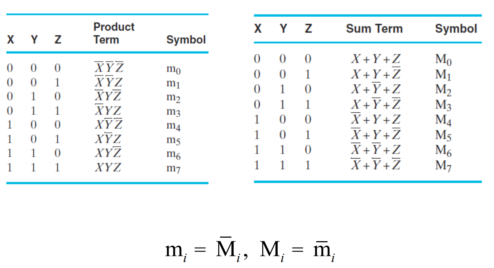
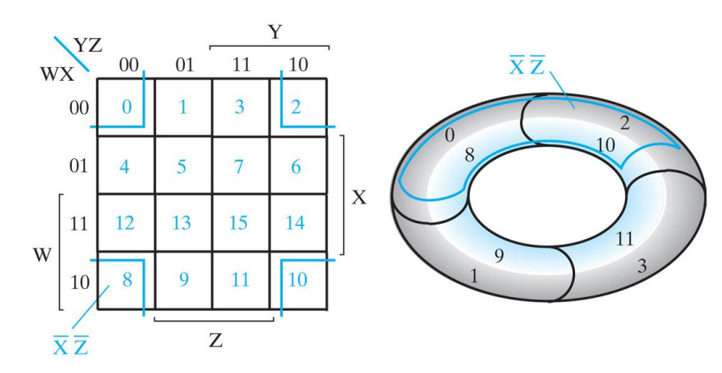

### 对组合逻辑电路中的加减法电路适用于什么的加减法忘了

- 具体是有符号还是无符号的

但自己现在分析的话该电路明显是有符号的，S=1时相当于加B的补码

> 回去看之前的结果是说两者应该都行，不过需要考虑溢出问题，无符号的溢出需要检验一个进位$C_n$，而有符号需要检验两个进位$V = C_n \oplus C_{n-1}$,
>
> PPT中说是采用无符号加减运算规则，其实也是，我们变成对应的加法电路之后是按照无符号来做的

### 对于最大项和最小项的转换规则忘了

具体问题就是$A+\overline{B}+\overline{C}$这种的最大项应该写成什么格式，回去看第一章的内容

如果按照这个理解的话，

右边图中的011对应的就是正确答案M3,自己要牢记其实就是01的值颠倒过来就可以了，不然也可以这样做：
$$
A+\overline{B}+\overline{C}=\overline{\overline{A}BC}=\overline{m_3}=M_3
$$

### 卡诺图可以看成空心圆柱？

三变量的怎么叫四变量的怎么叫正确的叫法应该怎么叫，回去看卡诺图化简部分的内容。

| 三变量                                                       | 四变量                                                       |
| ------------------------------------------------------------ | ------------------------------------------------------------ |
|  |  |

空心圆柱和空心圆环应该都是对的；

### 触发器的标准版符号复习一下，区分一下边沿触发器和脉冲触发器

| 锁存器和触发器标准图形符号                                   | comment                                                      |
| ------------------------------------------------------------ | ------------------------------------------------------------ |
|  |  |

> 有直角的是主从触发器（脉冲触发的），有三角形的是边沿触发器，啥都没的是锁存器；

### 回去复习状态机图的输出条件判断

输出条件约束就在于判断状态

- 输出条件约束1的判断在于看所有有/output前面的条件是否互斥，对于不同的output其输出条件一定要互斥（无论是转移弧上的还是连接状态的条件，只要后面跟着/output都是输出条件）；
- 输出条件二则是连着该状态的所有转移条件也好还是输出条件也好，加起来为1及可满足；

### 状态表的概念复习

一维状态表和二维状态表感觉上更多是输出和输入是否有关，但无论有没有关系两者都可以互相转换，只是二维状态表在输入和输出有关系的时候会看起来更加的舒服直观，而且可以直接看出卡诺图；再者，从Moore或者Mealy状态图的角度来看，二维状态表和输入输出更加有关所以适用于Mealy型的状态图，从而可以更好的画出出输入条件在弧上的那种图；而一维状态表代表输出只和状态有关，此时就可以把状态和输出放在一起，也就是Moore型。

