# 期末考试题目1

> 🐖是有疑问的地方，如果不想

|                             试题                             | 我的答案                                                     |
| :----------------------------------------------------------: | :----------------------------------------------------------- |
|   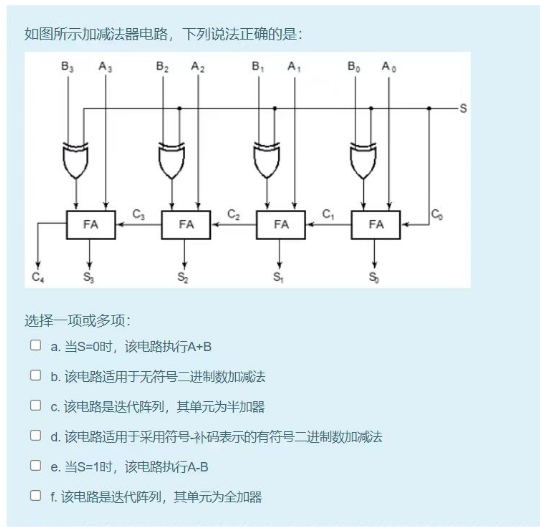    | abdef，有符号和无符号皆可                                    |
|   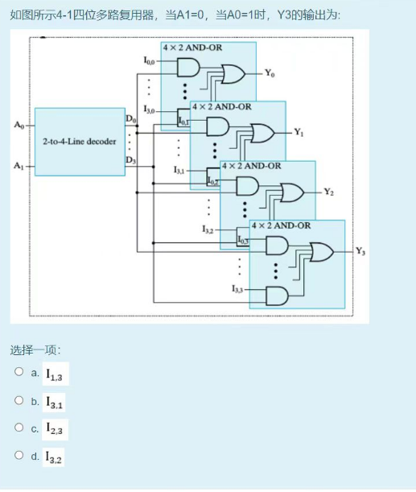    | a                                                            |
|   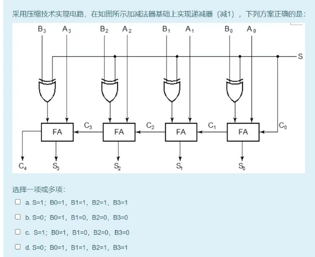    | cd                                                           |
| 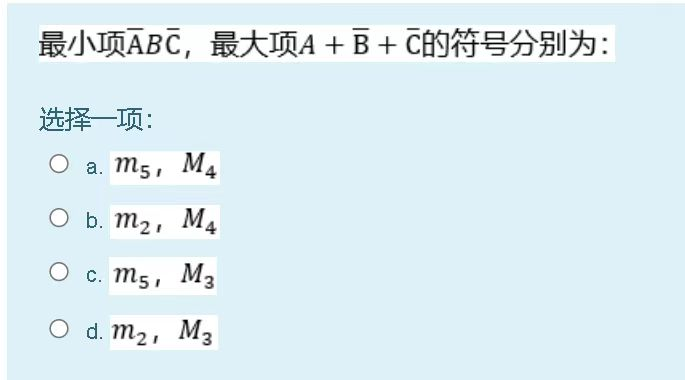 | 010👉m2 100👉011👉M3，选d                                  |
|   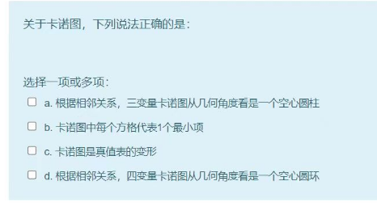    | abcd                                                         |
|   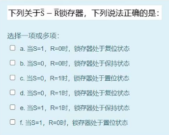    | 先回忆起SR是S=1置位，S=0现在就是置位，选ace                  |
|   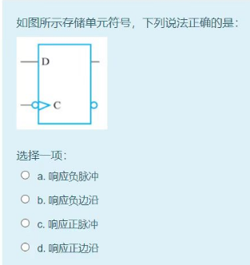    | 正边沿D触发器加了个反，那就是负边沿，选b                     |
| 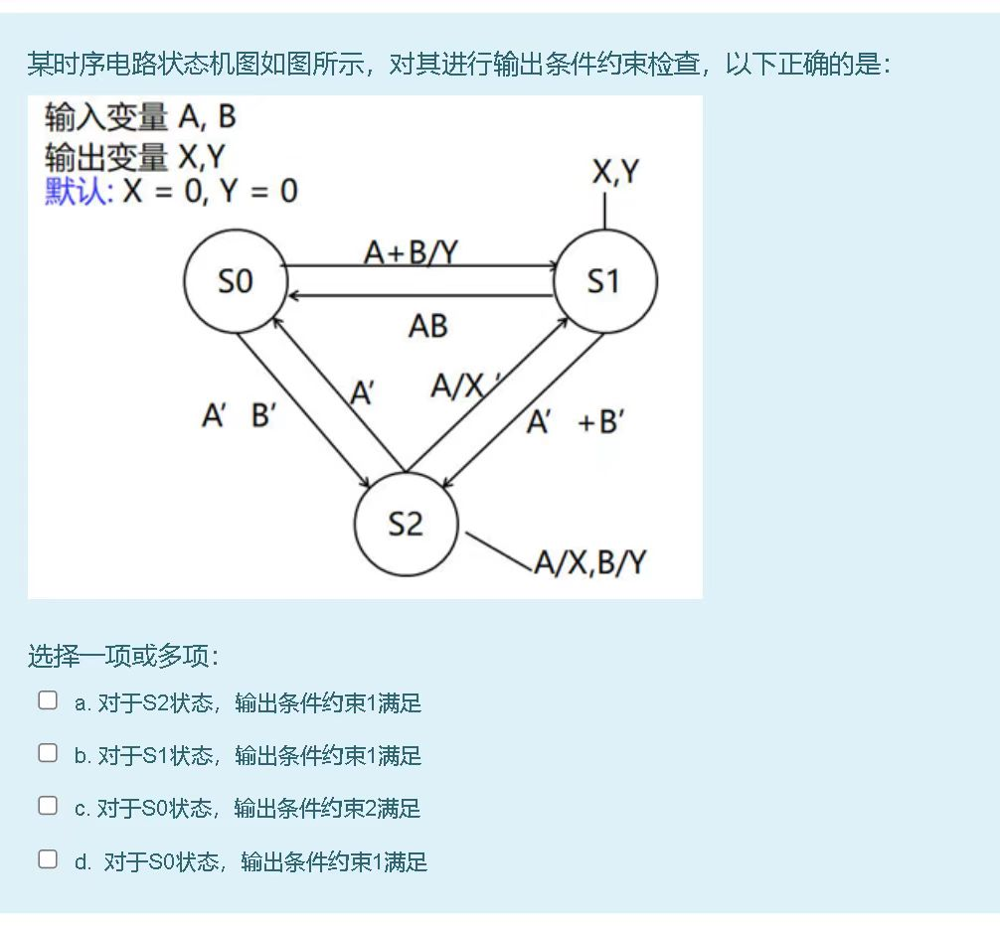 | bcd，不满足约束1，$A\times A \neq 0$                         |
| 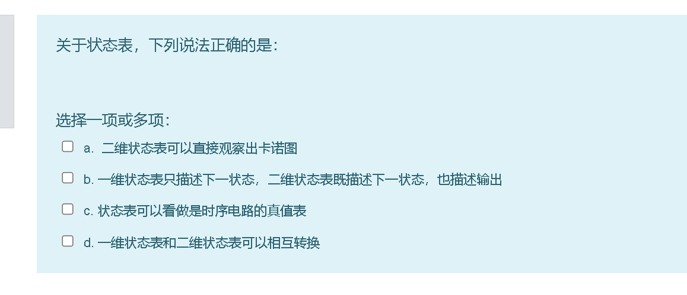 | 选acd，状态表的概念也忘了🐖                                   |
|   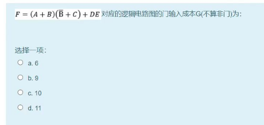    | 门输入成本，第一次见两个结合起来算的这种，10，回到定义来看就是10 |
|           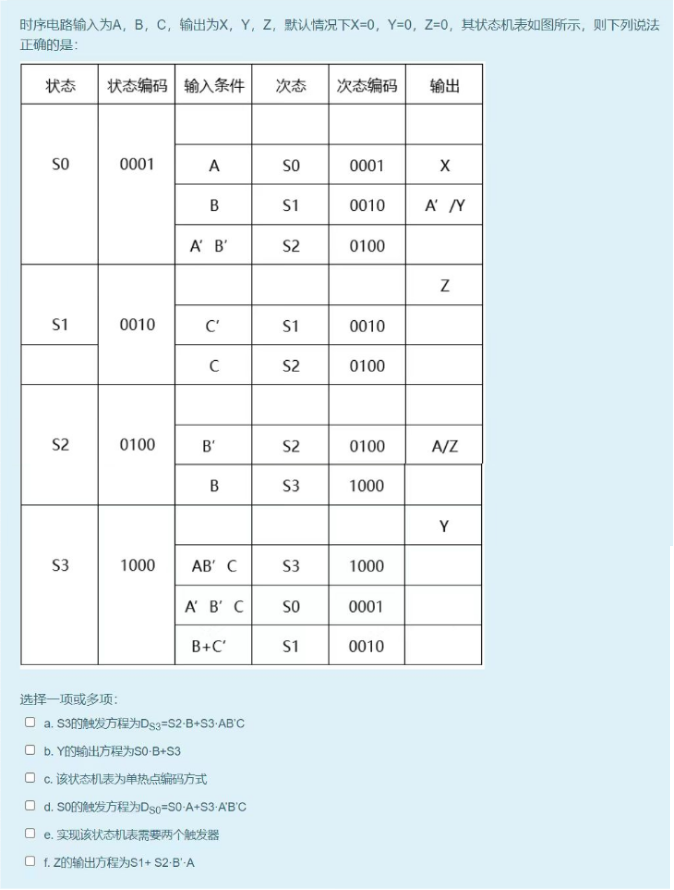            | acdf，b错                                                    |
|   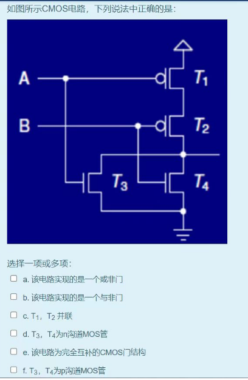    | ade                                                          |
|   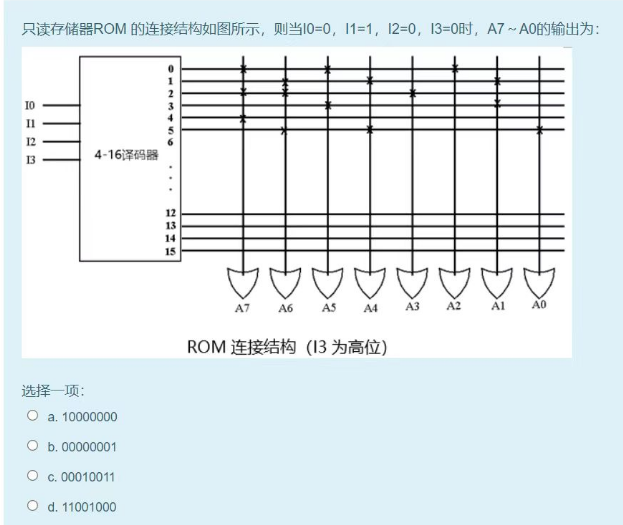    | 选d                                                          |
|            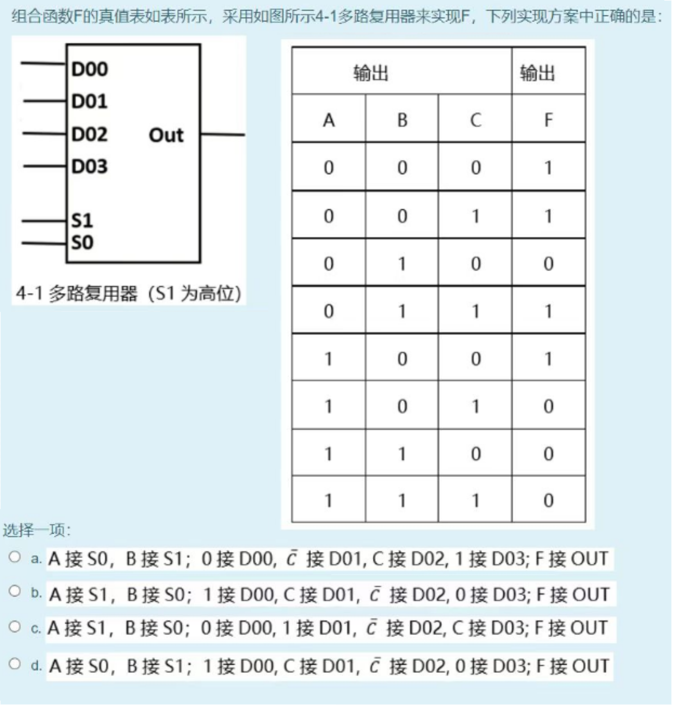             | b                                                            |
|   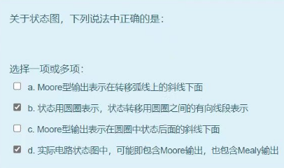    | a错，应该是连接状态，b正确，状态图还是状态机图，个人觉得c是对的，d正确 |
|   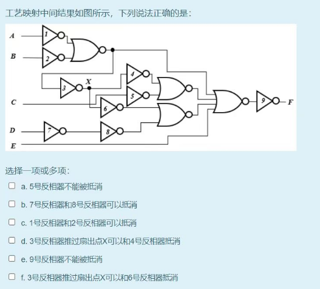    | abdef正确                                                    |
|                                     | 选d                                                          |
|   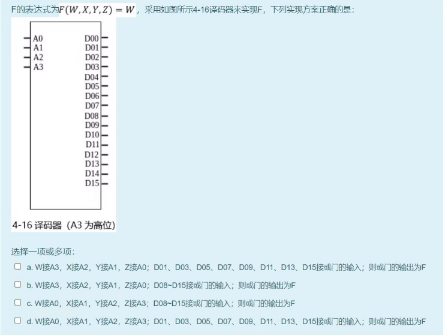    | 选bd                                                         |
|   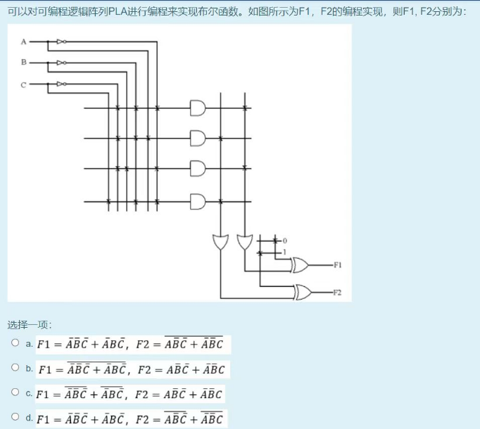    | 选a                                                          |
|   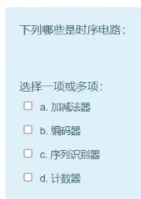    | cd                                                           |

